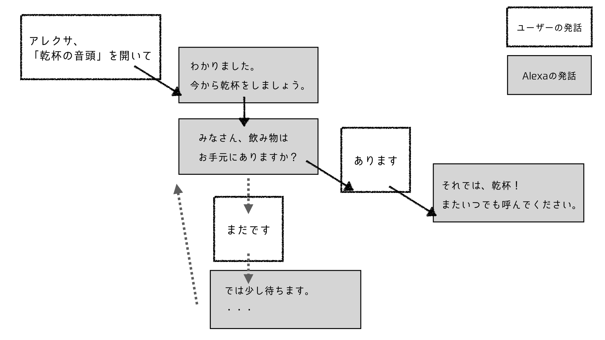
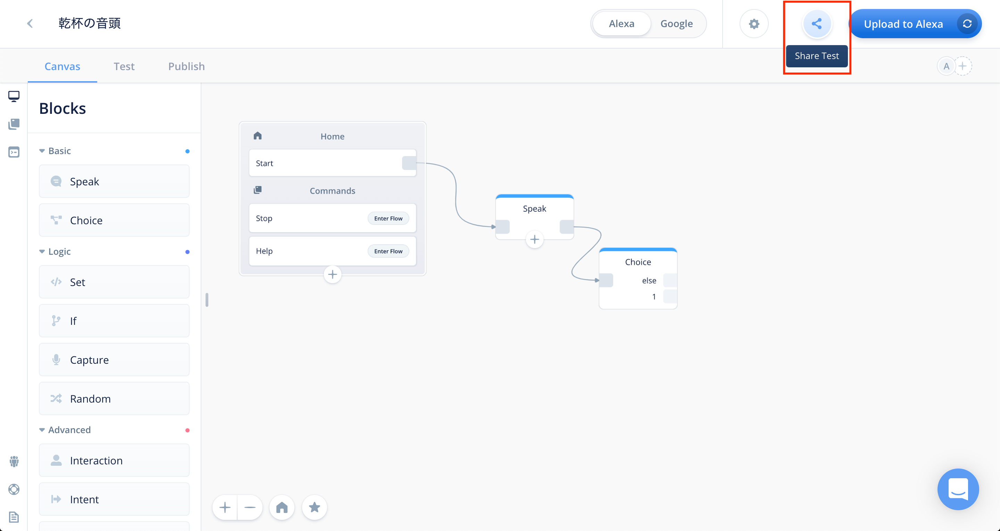
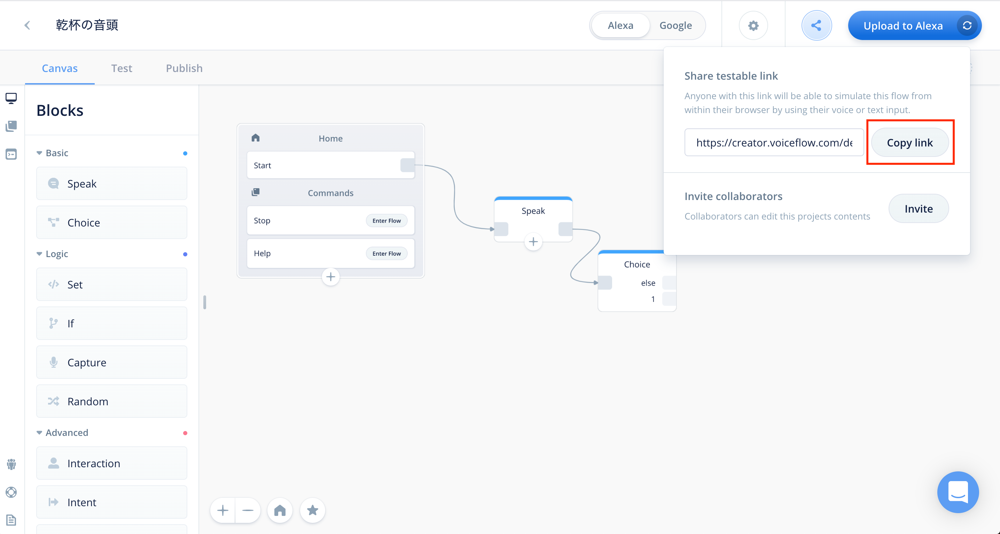
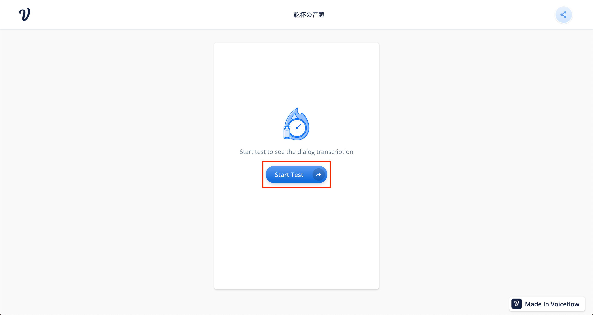
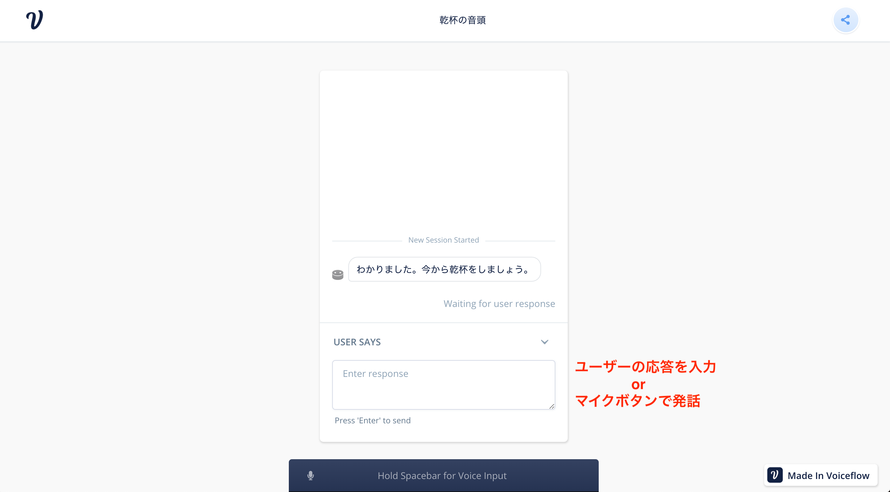
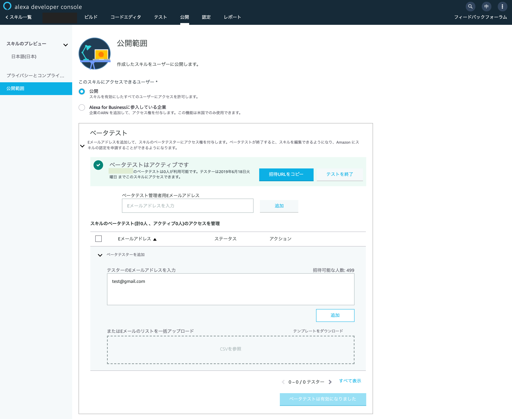
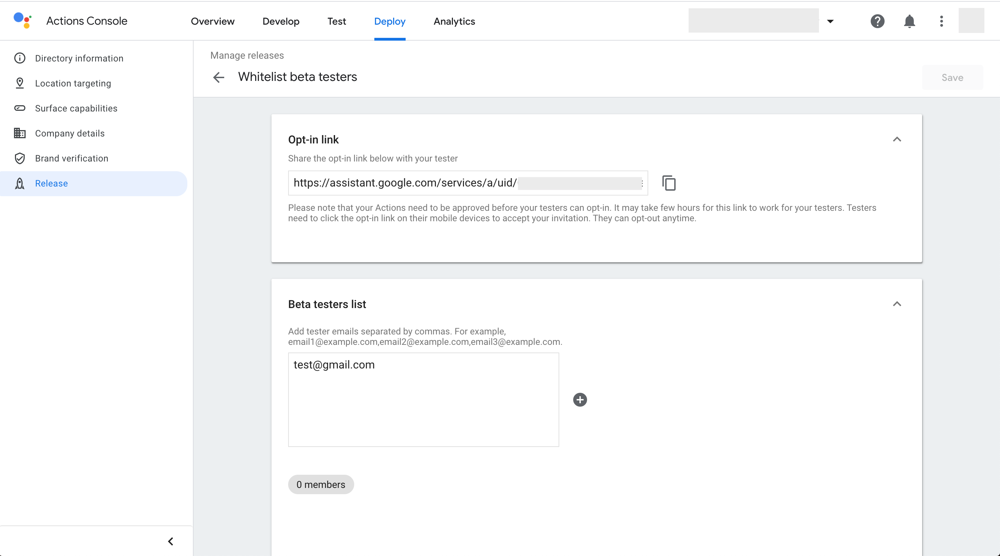

# Start prototyping with Voiceflow

I'm Aimi Nakajima, a VUI designer.
In this chapter, I would recommend "VUI prototyping" as an effective way to use Voiceflow.

## What is prototype / prototyping?

A prototype is simply a "prototype", a term widely used in the computer world.
In the context of design, it is used as a means of "service design," "design sprints," "concept verification," and so on. In some cases, tangible or intangible products are produced before embarking on actual development.
In application development, UI and interaction are created using tools such as Sketch and Adobe XD, and a sample that runs on a real machine in the form of a picture-story show.

Here, the prototype is defined as "a prototype that can be spoken with a real machine".
The actual device in VUI refers to Amazon Echo or Google Home smart speakers and devices with voice assistant.

Prototyping is a "prototype" activity.

## Who can use the prototype?

If you get this book, I think the tension is up, "Okay! Let's make a skill using Voiceflow right away."

That momentum is important, and it's definitely a benefit of Voiceflow that it's easy to get started.

Or maybe you're thinking, "I just want to build skills at explosive speed, so ignore this chapter."

Does a prototype matter to you?
The answer is yes.

Let's start with the usage scene.
First, let's classify the people who are trying to develop skills into three.

1. someone who loves smart speakers and wants to make something
2. People who have a clear idea that they should have such skills
3. People who are making skills at work for their company or clients or who are going to make them

The granularity and perfection of the skills you envision may vary, but prototyping is effective in any of 1-3 cases. As described in another chapter, browser test can be performed on Voiceflow, so PDCA (Plan / Do / Check / Action) can be turned by repeating Build⇒Test there. However, a prototype is a "prototype that can be spoken with a real machine." You can experience both "how Alexa / Google speaks" and "how you speak" at the actual stage, even before releasing your skills or at the idea stage. I don't think there is any better experience. And if you use the beta test invitation in the simulator on the platform, you can let other people use it before it is released. This is also the real pleasure of the actual machine test.

## Prototype benefits

I was shocked when I met Alexa, and from there I got into VUI and now I'm working on VUI design. I usually support the design and development of skills for clients, but I am not an engineer, so I think about VUI and communicate with the engineers who develop. At that time, rather than explaining only utterance examples and flow diagrams in Excel etc., we will make a prototype in advance and demonstrate using a smart speaker to show `` this is what you want to implement '' I am. There may be discrepancies in perception on paper and web diagrams, but the level of communication will be overwhelmingly high if you can talk and see yourself.

## Prototype starts with Happy Pass

I will talk a little about VUI design techniques. Once you have the idea of a skill that can do ◯◯, create a “happy pass”.
Happy Pass is the "smoothest interaction flow to achieve the goal of that skill".

The VUI can fork off instead of a single flow, but let's put it aside and start with a success story.
Let's take a look at the Happy Pass using the Alexa skill "Toast of Toast" that I have released.

The solid line is a flow that is not a happy pass, and the dotted line is a flow that is not a happy pass. First of all, if you want to try the core function of the skill, just make a happy pass and it is enough to start.

## When you finish the test yourself, let others try it

If you can do so, let's launch Voiceflow. Two types of "Speak" and "Choice" explained in another chapter are enough. Once you have made the flow (omitted here), I will introduce the procedure of distributing a test that can be done with a browser to anyone other than yourself.

1. Click the Share icon at the top right of the screen.

2. When the URL for sharing is displayed, click "Copy link" on the right.

3. This screen is displayed to the person who shared the URL. Click Start Test.

4. You can test your own voice by entering the text to be spoken by the user in the text form or by pressing and holding the microphone button on the PC.
It is a good idea to test your voice.

If you use it on your browser, you will get some kind of feedback. I hope that you can enter feedback comments in the future. From there, improve your VUI and submit beta tests on the Amazon Developer Console or Actions on Google. Finally, you can have it tested on a real machine.

▼ A beta test invitation screen of Alexa Developer Console

▼ Actions on Google α ・ β test invitation screen

## Use Alexa and Google Assistant properly

The nice thing about Voiceflow is that both Alexa and Google Assistant are compatible. And the project can support both platforms. The Voiceflow test tool is one voice, but after deploying, let's listen to it on the actual machine and on the Alexa and Google simulators. that? The atmosphere is different in each. I think you will notice.

Alexa and Google Assistant have different spacing and intonation even in the same Japanese. Both are not native Japanese, so they often do not read kanji with the intended sound. Being aware of them as early as possible will also help you improve your conversations later.

## Summary

Feedback from others is very important to create skills that will be loved and loved by more people. Before publishing your skill and writing a sharp review and being shocked, we recommend that you first verify it with a prototype. It's safer to get feedback from your friends and acquaintances and show them to the world. Prototyping with Voiceflow is an easy way to create and try MVP (minimum viable product). Please, try it.
