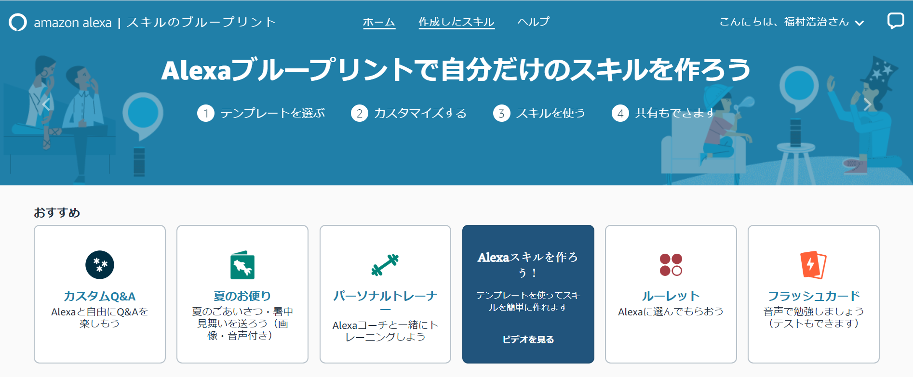
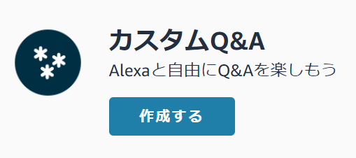
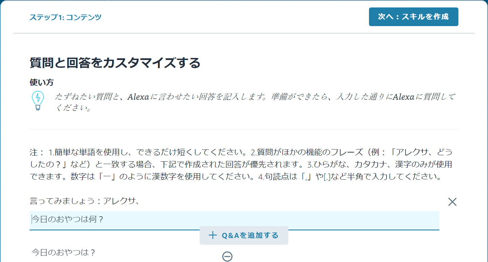
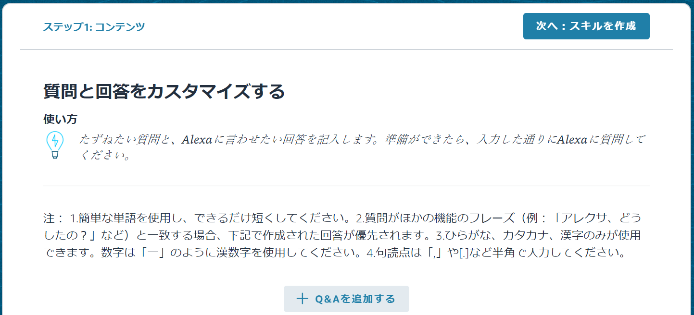
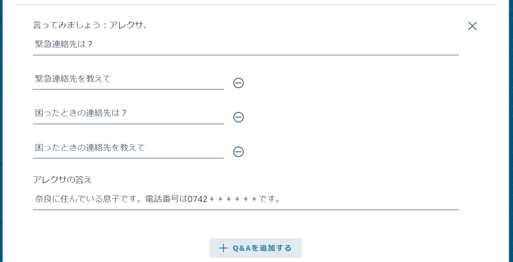
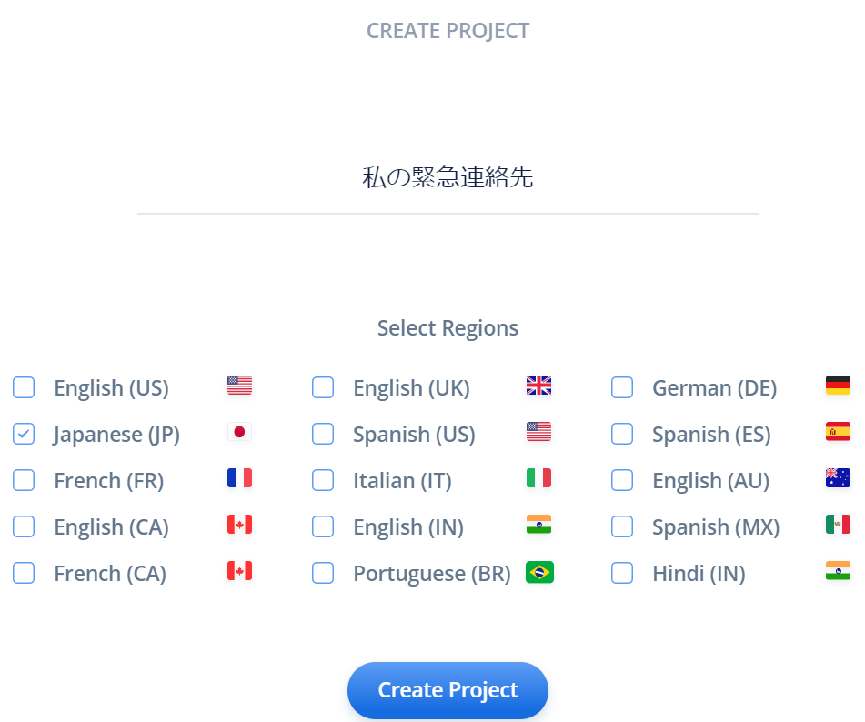
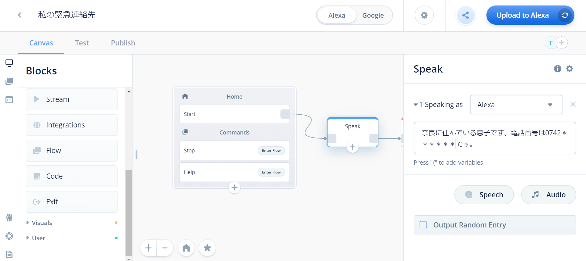
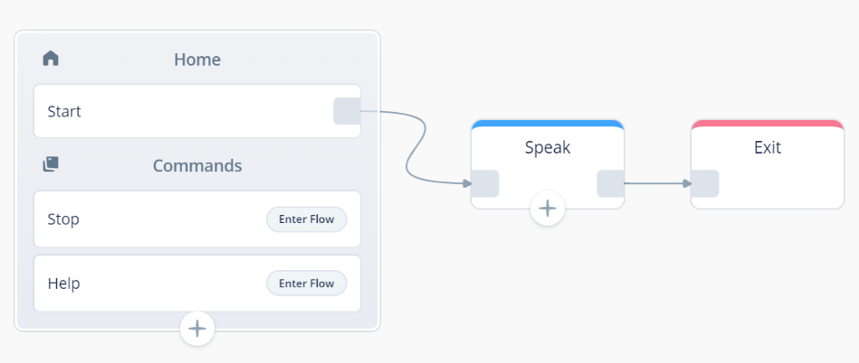

# How to easily make olec skills
Voiceflow, which can be developed with non-coding, may want to develop Alexa skills and Google Actions (hereinafter "skills") on their own.

So, what kind of skills you should actually develop, Voiceflow is, by its nature, better suited for non-engineers to make a little skill.
It is good to develop skills and have everyone make them, but it is also a benefit of non-coding Voiceflow that it is easy to create your own skills to improve your life.

In this chapter, let's consider the use cases of skills that snuggle up to your own life, and let's challenge the development of "Oletoku" skills!

## Use cases for skills that snuggle up to life
Now, what is the content suitable for skills? Naturally, you can't do anything, and functionally you can't do more than you can usually do with your smartphone. Skill identification is a VUI (Voice User Interface) that can be exchanged by voice.

The only way to operate a smartphone is with your finger. However, if you are a skill, you can operate it by voice, so let's consider a use case that can make the most of that advantage. The three points below are the points.

* Can be operated while
* No need to look at the screen
* Can be activated immediately (if there is a smart speaker nearby)

Operation is possible while ###
This is useful in situations where both hands are occupied, for example, when you want to listen to a recipe while cooking. Speaking of skills, it is common to take advantage of this advantage, and you often listen to busy times in the morning while preparing, listening to the news, and listening to the weather. It is often said that after purchasing a smart speaker, it has only been used to listen to the morning weather, but opening the smartphone, searching the weather and checking the contents, Being able to do it while preparing is a big advantage.

### No need to look at the screen
Recently, there are many smart speakers with screens, such as the Echo Show, Google Nest Hub, and Clova Desk, but the screens are only supplementary and the essence of skills is that they can be completed by voice exchange. The lack of a screen is also effective for people with visual impairment and presbyopia. The lack of a screen also means that you do not need to learn complicated operations such as pressing which button and then selecting which button. Isn't it a great benefit of skills that the learning cost for operation can be reduced?

### Can be activated immediately (if there is a smart speaker nearby)
If it is a smartphone, it wakes up from sleep, performs password or fingerprint authentication, then starts a browser or application and performs the desired operation, but in the case of skills, the smart speaker is constantly in a standby state So you can immediately perform the desired operation. Fewer steps also leads to lower learning costs for the operations described above.

There is a condition that there must be a smart speaker nearby, but recently, in addition to smart speakers, cars and appliances can be operated with VUI. In particular
Alexa has an "Alexa Everywhere" initiative that aims to provide a voice-enabled user experience everywhere.

Hold down these points and consider an effective use case in consideration of your living environment!

## Is VUI for the elderly?
I usually work as a nursing engineer, but I feel that VUI is an interface for the elderly. In particular, the above-mentioned point "no need to look at the screen" is consistent with the fact that you can not see the smartphone with presbyopia and the learning cost is low.

Presbyopia → No need to look at the screen

I do not want to learn new operations →→ Can be operated in a conversation as in everyday life

For example, my father is a 75-year-old senior, but does not have a smartphone. In other words, it would be nice if you could make a phone call, and you couldn't see such a small screen because of presbyopia. When such a father got on the train, he seemed to be unable to see the fare table of the destination, and said that it was very troublesome to always ask the station staff. In the end, by purchasing a transportation IC card such as Suica, I was able to solve this problem, but what if I had a VUI at this time? If you ask, "Tell me the price from the * station to the ** station," you may not even need a transportation IC card. but.)

Also, some people who live away from their parents may be worried that contact may be delayed if their parents suddenly fall down. In such a case, I thought about such a use case, so that anyone should be able to ask the smart speaker for emergency contact information.

In fact, you should write a prominent note to that effect and a startup note so that everyone knows that the smart speaker will provide emergency contact information. Then it is faster to specify the emergency contact directly there! However, the advantage is that if the skill changes, even if the contact information changes, it is only necessary to change the contents of the skill without going to both parents' home.

## Blueprints option!
Now, let's actually create a use case.

Then, immediately on the Voiceflow screen. . . wait a minute!

As with Voiceflow, there is a way to create Alexa skills without coding, called Blueprints.

Please access [https://blueprints.amazon.co.jp/](https://blueprints.amazon.co.jp/).

Blueprints comes with pre-made templates that you can customize to easily create Alexa skills.
As of January 2020, the following templates are available.

* Greetings (summer letter / celebration / thank you / birthday celebration)
* Random message system (Thank you father / Thank you mom)
* Flash card
* Personal trainer
* Roulette
* Custom Q & A
* Trivia

Among them, “Custom Q & A” has special features.
Usually, the skill is activated by speaking "Alexa, (opening the skill name)", but there is no need for custom Q & A. By speaking "Alexa, (question content)", Alexa answers Will return.

## Create skills with Blueprints and Voiceflow
Now, let's actually create and compare skills with Blueprints and Voiceflow, using the example of "Tell me an emergency contact" mentioned above.

### Blueprints (Custom Q & A)
On the Blueprints home screen ([https://blueprints.amazon.co.jp/](https://blueprints.amazon.co.jp/)), select “Custom Q & A” and press the “Create” button .

The default question and content are displayed as the initial display.

(The default question is what you would use in everyday life, such as snack content and your favorite place!)

This time, the default contents are unnecessary, so delete them once.

(There is no problem if you do not delete it.)

From here, press the "Add Q & A" button and enter the questions and answers to be asked for emergency contact information.

Please enter some possible questions, such as "What is your emergency contact?" If you always say this phrase, you can use only one, but it is better to be as flexible as you can without stress.

Next, enter your answer. Here, I entered my son's phone number as an emergency contact.

After entering, click the “Next 次 Create Skill” button and you are done. The skill is completed in a few minutes.

Ask "Alexa, emergency contact?" On the Alexa app or Echo device. It should return an answer.

(Unlike Blueflows and regular skill development, Blueprints does not have a console screen for testing.)

### Voiceflow
Next, let's make the same contents in Voiceflow.

Press "Create Project" on the Voiceflow home screen.

Unlike the custom Q & A of Blueprints, you need to enter the skill name, so let's call it "My Emergency Contact".

The following are possible ways to create skills to answer multiple questions and answers, but in this case we want to know the emergency contact information, so we chose the latter in order to give priority to responding immediately.

* Create a skill to ask multiple questions and answers, and branch according to the utterance in the skill
* Create multiple skills to answer one question and answer

First, add a Speak block and enter your answer.

Finally, add an EXIT block to end the skill, and that's it.

Press the "Upload to Alexa" button to complete your skill.
Just say "Alexa, open my emergency contact" on the test console, Alexa app, or Echo device. It should return an answer.

//embed[latex]{
\clearpage
//}

## Create skills even for non-engineers!
In this way, skills can be created even with non-coding. Not only engineers but also non-engineers may be having troubles in daily life from the viewpoint of users.

Blueprints can create skills very easily, instead of only creating skills according to the prepared templates.
Voiceflow, by comparison, is more complex than Blueprints, but you are free to create skills.

Use Voiceflow and Blueprints in the right place, not the other way, and challenge yourself to create skills!
