# Think about engagement
## Introduction
"I'm glad if I have that skill", "I'll be happy if I can make such a skill" Voiceflow allows you to start developing skills as soon as you come up with it.
If you want to make it with great effort, you want to create skills that will make the users happy and easy to use. @<br>{}

In this chapter, I'd like to think about how to create a skill that allows you to have a little attachment and a feeling of attachment.

### Audience
This chapter is for the following people:

- Those who have touched Voiceflow a little
- Those who feel comfortable talking with VUI Assistant

## Let's be conscious
### What is engagement?
Engagement is, in a nutshell, a "connection" of intimacy, attachment and affection. @<br>{}

In order to increase engagement, you need to think about "who will use the skill" and "what are the benefits of using the skill".
To get to know the user deeply (specifically define), we use a tool called Persona.

### What is Persona?
The persona is the most typical user profile for the service.
By specifying the user profile and fitting it to the user, we will be able to provide more satisfactory services.

//embed[latex]{
\clearpage
//}

You do not need to think too much.
Voiceflow's strength is that it allows you to develop skills without knowing any specialty, so it's a good idea to think of a person as having a solid image in order to create skills specific to that person. @<br>{}

There are three benefits to setting a persona:
>-A common figure can be formed between the persons in charge
>-Can increase the accuracy of the user's viewpoint
>-Time and cost can be reduced

From ferret. URL: https://ferret-plus.com/8116

## Development of sample skills
Then, let's develop skills while thinking about engagement. @<br>{}

For example, suppose an elementary school child came up with a skill to check timetables.
"Elementary school students" are abstract, so we will send more to users.

### Persona settings
Let's set the persona.
If a specific user has been decided, the user is imaged and organized.
There are various ways of thinking about what to organize, but at first you can just list what you know.
It is important at this point that you do not select information. I don't know where or how it will help, so let's leave it to the user for a later choice. @<br>{}

Here, I will write two elementary school student personas so that you can see the difference in what is required even with the same theme.

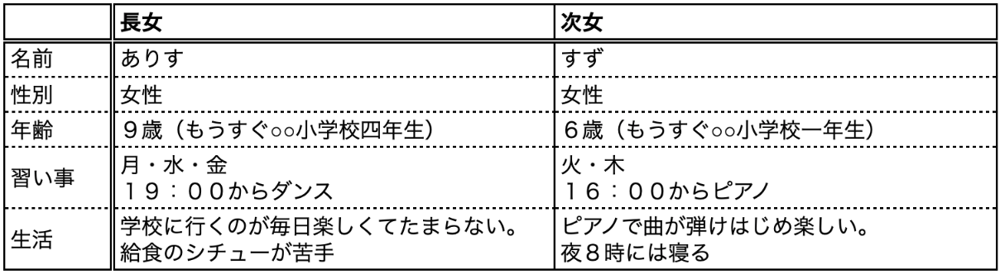

It's easy, but considering the timetable skills along each persona

- Since my eldest daughter is almost a fourth grader, I can imagine preparing for the next day by myself.
- Since the second daughter is not yet enrolled, she is not accustomed to preparing for the next day alone, so "Skills to prepare together"

Seems to be pleased. @<br>{}

If you organize your users, you'll find that even the same theme skills are different.

### UI considerations
Next, consider the UI for that skill.
I started thinking with VoiceUI, but at this time, consider whether you really need it.
There is no need to consider both input and output by voice. It can be combined with existing UIs, so consider what works best for improving the user experience. @<br>{}

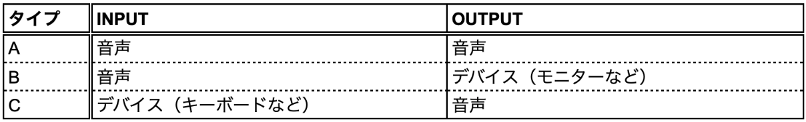

In the example, the usage scene of children using skills is imagined as follows.

- I am staring because I watch the timetable distributed by the school
- I can't use both hands to put the textbook in the school bag

Therefore, we thought that audio type A was suitable for both input and output.

//embed[latex]{
\clearpage
//}

### Conversation flow and content
With the persona set, the situation and issues became clear, and it became clear that it was necessary to change the conversation and content between the eldest daughter and the second daughter.
Think about the conversation flow and content along each persona.

#### In case of eldest daughter
I prepared for the next day myself, so I asked the eldest daughter to speak what I had prepared, and the assistant made a decision on OK / NG.
Talk with your assistant in a quiz format, and aim to make it fun to answer correctly.

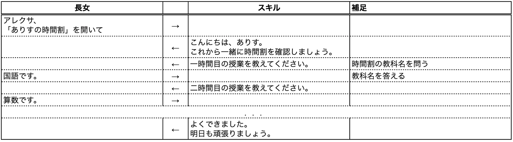

#### In case of second daughter
I wanted my assistant to be ready, so I asked her assistant what to prepare and let her answer what she could or couldn't do.
Again, we aim to make it more fun to prepare yourself.

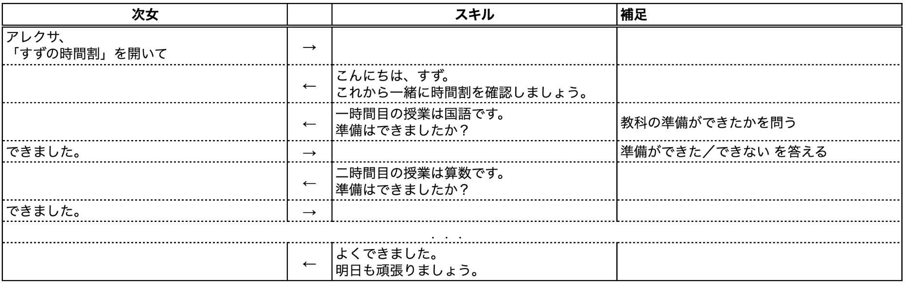

//embed[latex]{
\clearpage
//}

### Create skills with Voiceflow
Although the theme of the timetable and the conversation flow are the same, the conversation content is specialized for each and it can be said that the engagement is high.
Let's make a skill in Voiceflow according to this design document. @<br>{}

In the example, skills are created from the conversation flow of the second daughter.

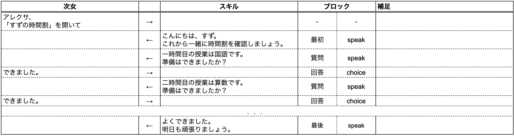


With this, the skill for exclusive use of the second daughter is completed.

//embed[latex]{
\clearpage
//}

## To increase engagement
### Synonym
In human-to-human conversations, "yes" and "yes" are unconsciously recognized as synonyms, but assistants do not know if they are synonyms.
Therefore, register synonyms (including mistakes) that the user is likely to say, so that the conversation will be smooth. @<br>{}

In the example, we will register synonyms for "Done".

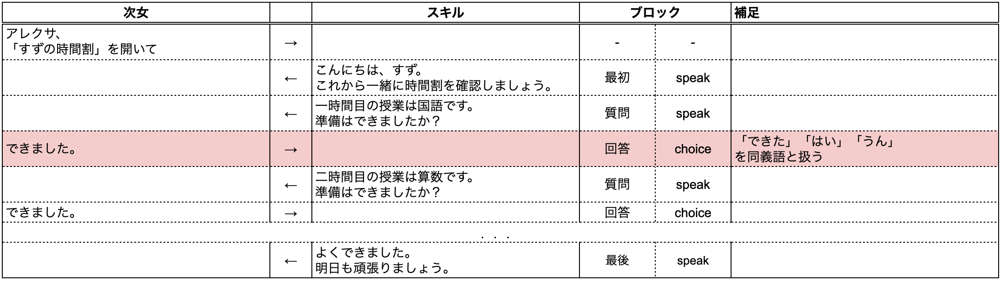

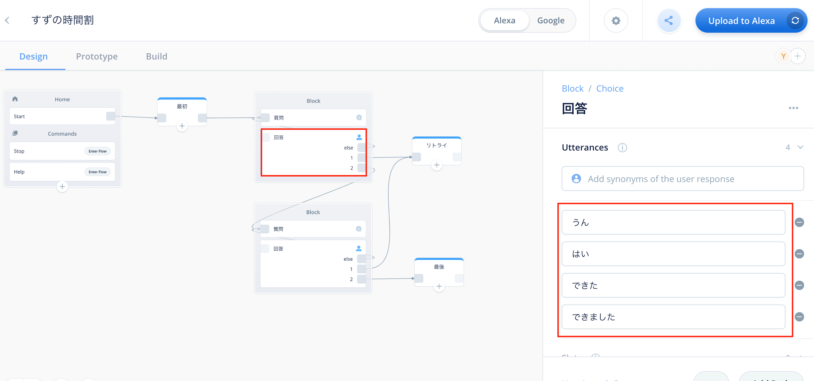

Now you can answer "Is it ready", "I'm done", "Yes", "Yeah" to the question "Are you ready?"

//embed[latex]{
\clearpage
//}

### Date and time information
Using the date information when the skill was used, it is possible to change the message according to the day of the week and time zone, and to have a conversation according to the user's calendar etc. @<br>{}

In the example, the day before each lesson, I will say an additional message to support the piano.
Refer to the Voiceflow forum for how to use the "code" block.
https://forum.voiceflow.com/t/getting-the-users-time-zone-in-your-skill/314

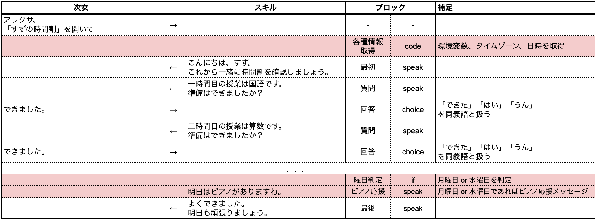

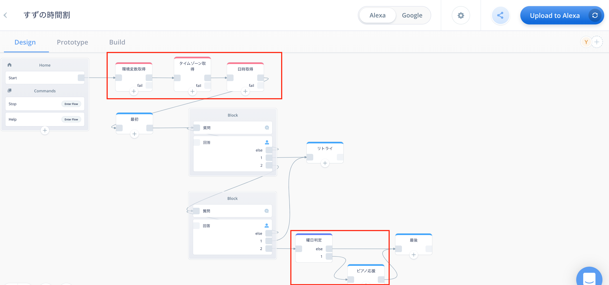

The day before the piano, I can now say, "Tomorrow is the piano."

//embed[latex]{
\clearpage
//}

### SSML
SSML is called Speech Synthesis Markup Language, and is an XML-based representation of various voice information, including spoken words.
It makes it easier to effectively appeal to the user, such as "fasten", "increase", or "change intonation" the utterance speed.
The tags supported by each vendor are different or have their own tags. When using them, check which tags can be used before using them.

- alexa
  -https://developer.amazon.com/ja-JP/docs/alexa/custom-skills/speech-synthesis-markup-language-ssml-reference.html
- google
  -https://cloud.google.com/text-to-speech/docs/ssml?hl=en


#### Sound library
If you want your assistant to play sound effects, use the sound library.
The sound library is released by each vendor as sound effects for skills and can be used freely.

- Alexa Skills Kit sound library
  -https://developer.amazon.com/ja-JP/docs/alexa/custom-skills/ask-soundlibrary.html
- Google Assistant Sound Library
  -https://developers.google.com/assistant/tools/sound-library


In the example, if you answer "OK" to the question "Are you ready?", The sound effect is played using the audio file provided by the vendor.
Enter the `audio` tag in the" speak "block. For Alexa skills, you can copy and paste the tags in the sound library, so you can copy and paste them.

```
<audio src = "soundbank: // soundlibrary / ui / gameshow / amzn_ui_sfx_gameshow_positive_response_01" />
```

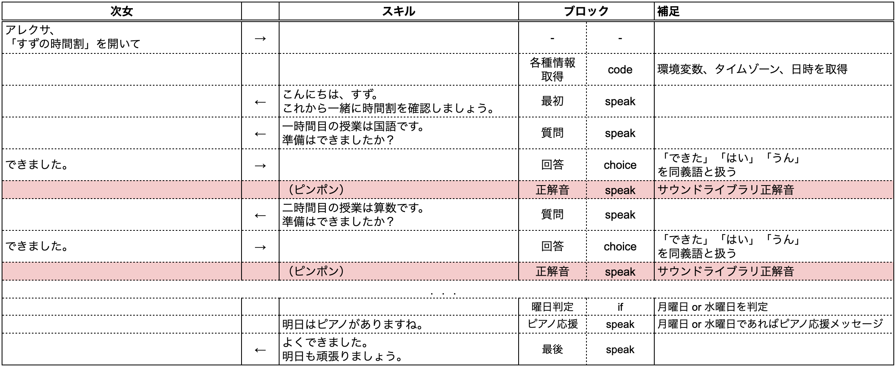

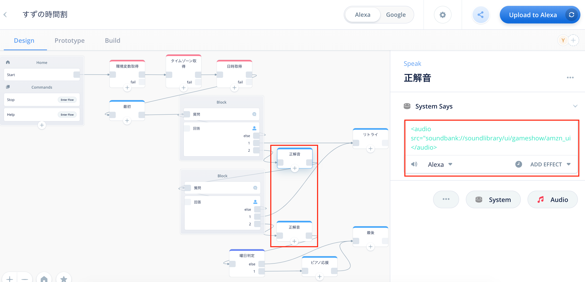

Now you can tell the correct answer by sound.

//embed[latex]{
\clearpage
//}

#### Speechcons
Use Speechcon if you can hear it in a conversation with your assistant. @<br>{}
Speechcon is a special word that the assistant speaks expressively.

- Alexa
  -https://developer.amazon.com/ja-JP/docs/alexa/custom-skills/speechcon-reference-interjections-japanese.html


In the example, the first greeting the "Hello" to the speech using the Speechcon.
Enter `say-as` tag and attribute` interpret-as = "interjection" `in" speak "block.

```
<Say-as interpret-as = "interjection"> Hello </ say-as>
```

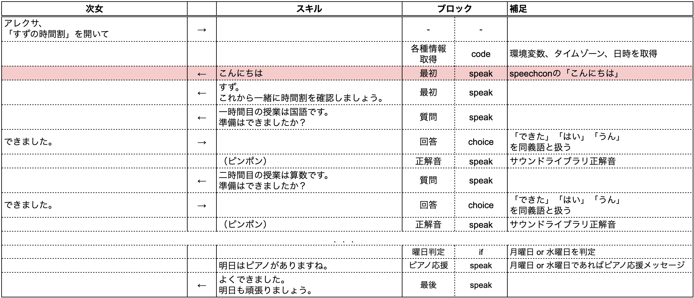

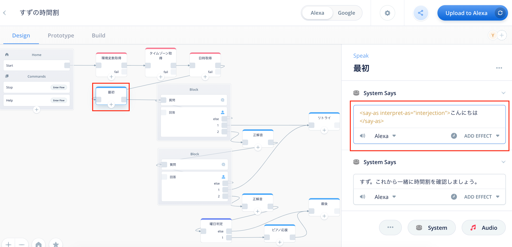

Now, "Hello" is now expressive.

## in conclusion
Voiceflow has other features to increase engagement, including:

- Use user specific information in User category "user info" in Blocks menu
- Link externally with the Advanced category "Integrations" in the Blocks menu

Let's enjoy the skill development that allows users to think and use them with attachment.
