# Create your own smart remote with M5StickC and control home appliances from Google Home

Ito. I wrote this chapter to make it easier for people in the electronic work cluster to know "how to attach a voice operation interface easily".
Or, if you're a VUI cluster member, it's super fun if you haven't done so yet.@<br>{}
This time, we use the popular low-priced microcontroller "M5StickC". There is no worry about electric shock because it is not in the exposed __board__ but in the case. @<br>{}
Voiceflow supports both Google Home and Amazon Echo, so use whichever you have. A smartphone app is also OK.
In addition to Voiceflow, we have a collection of techniques that can be used for IoT prototyping, such as MQTT and IFTTT, so we hope you find some hints.

#### things to do

* Create infrared remote control with M5StickC
* Adafruit MQTT settings
* Make a simple MQTT publisher with IFTTT
* Create Actions On Google with Voiceflow
* Make the M5StickC remote control compatible with MQTT
* Connect everything and check operation
* Compatible with Amazon Alexa


#### Development environment

* MacBook Air (macOS Mojave)
* Arduino IDE 1.8.9
* Chrome latest version
* Notepad (your favorite editor. I used the usual VSCode)


I used a Mac, but Windows has common tools. Please read as appropriate and proceed.

#### Parts used, smart speakers

* M5StickC ¥ 1,980 @<fn>{sitopp_prices}
* Infrared transmitter/receiver unit for M5 ¥ 308
* Google Home mini

M5StickC has infrared transmission function, but no reception function. This time, M5StickC is also used to check the infrared command pattern of the home appliance remote control, so I used an M5 infrared transceiver unit to receive infrared.


In addition, the infrared transmission distance of the infrared transmitter / receiver unit for M5 is much longer than the transmission distance of the M5StickC main unit. With the M5StickC main unit, it only reaches about 50 cm, but with the infrared transmission / reception unit for M5, it flies from 1 meter to 1 meter and 50 cm. For this reason, this article uses this unit for infrared transmission.


I think that Google Home mini was bought at a discount sale for about 3000 yen. Now it's renamed Google Nest Mini. Even if it is not Google Home mini, the Nest series is OK, and if you do not have a real machine, you can also use the iPhone or Android ```Google Assistant application```.

//footnote[sitopp_prices][Price of M5StickC and infrared transceiver is the tax-included price as of January 12, 2020 on the switch science mail order site. ]


//embed[latex]{
\clearpage
//}

## Infrared remote control created with M5StickC

### Install Arduino IDE

Install Arduino IDE. Skip those who are already using it.

* Open the Arduino web page (```https://www.arduino.cc/```) in chrome.
* Click "SOFTWARE" → "DOWNLOAD".
* Click "```Mac OS X 10.8 Mountain Lion or newer```" in the paragraph of "Download the Arduino IDE".
* When "Contribute to the Arduino Software" page opens, click "JUST DOWNLOAD" @<fn>{sitopp_donate}.
* Wait for the download of the approximately 200MB file to finish.
* Expand the downloaded zip file and the application "Arduino.app" will appear. Move to the application folder.


//footnote[sitopp_donate][If you want to support their activities, please donate (＾ o ＾)]

* Start Arduino IDE.
* The editor "sketch_date" opens, but closes without saving because it is not used now.
* Click "Arduino"> "Preferences .." to open "Network" of "Preferences" screen.
* Click the window icon to the right of the "```Additional Board Manager URL```" input field.
* Enter 2 lines as below and click OK.

```
https://dl.espressif.com/dl/package_esp32_index.json
http://arduino.esp8266.com/stable/package_esp8266com_index.json
```
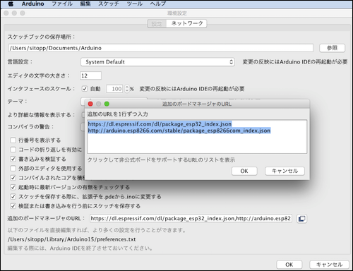

* Click "OK" at the bottom right of the "Preferences" screen to close it.
* Next, open "Tools" → "Board: ~" → "```Board Manager...```".
* Enter "```esp32```" in the input field to the right of "```Type All```'.
* If "esp32 by Espressif Sysrems" is hit, click "Install".
* When the installation is completed, click "Close" to close ```Board Manager```.


* Next, click "Sketch" → "Include Library" → "Manage Library".
* When "```Library Manager```" opens, enter "``` M5StickC```" in the input field to the right of" ```Type All```".
* If "M5StickC by M5StickC version ~" is hit, click "Install".
* When the installation is completed, click "Close" to close ```Library Manager```.
* Quit the IDE with "Arduino" → "Quit Arduino" and restart.


You have now set up the Arduino IDE.


### Capture command pattern of infrared remote control with M5StickC

Use the infrared remote control of the home appliance you want to use and the M5StickC, so please have them at hand.


* Attach ```Infrared transmitting/receiving unit``` to M5StickC.
* Connect M5StickC to Mac with USB Type-C cable.
* Select "Tool"-> "Board"-> "M5StickC".
* "Tools"-> "Serial Port"-> Select the option that contains "/dev/cu.usbserial-" from the displayed options.

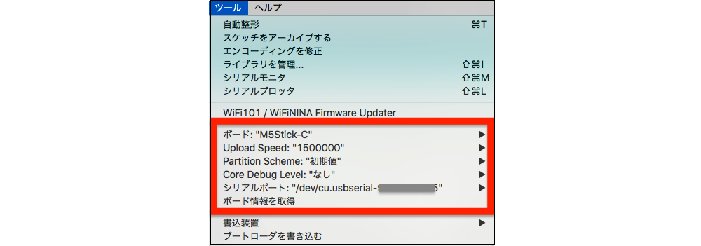


* Enter "Tools"-> "Manage Libraries"-> "IRremoteESP8266" of Arduino IDE and install the displayed libraries.
* Open “File” → “Sketch example” → “IRremoteESP8266” → “IRrecvDumpV2”.
* Open the sketch editor from "File"-> "New File", and delete the entire text of the code displayed below.
* Copy the full text of "IRrecvDumpV2", paste it into the sketch editor, and rewrite only the following line.

```
const uint16_t kRecvPin = 14;
↓
const uint16_t kRecvPin = 33;
```

* Click the “→” icon at the top left of the sketch editor and write to M5StickC.
* You will be asked for the save location, so save it under the specified Arduino folder.
* It takes tens of seconds to several minutes to compile and write the sketch, so wait patiently.
* Since I no longer use the sketch of "IRrecvDumpV2", click the x on the upper left to close it.
* The installation log is output in orange letters on the black background displayed below the sketch editor.
* Installation is complete when the following message appears.

```
Writing at 0x00008000... (100%)
Wrote 3072 bytes (128 compressed) at 0x00008000 in 0.0 seconds
Hash of data verified.

Leaving...
Hard resetting via RTS pin...
```

* Click "Tools" → "Serial Monitor" to open a new screen.
* Make sure "Auto Scroll" is checked.

Next, use the remote control of the target home appliance.

* Operate the remote control within 20-30cm of the infrared unit. (See the figure below)
* Code is output to the serial monitor.
* Copy the full text of this log and save it in Notepad.

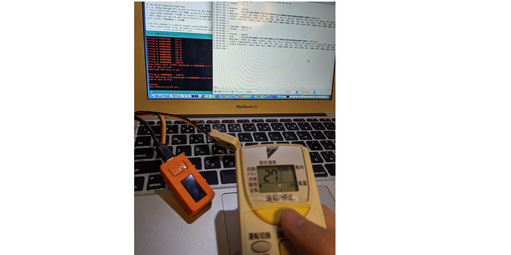

Example) The command pattern of infrared rays when pressing OFF and ON once each on the remote control of Daikin's air conditioner in my home is as follows.

```
21:39:17.721 -> Timestamp: 000130.976
21:39:17.721 -> Library: v2.7.1
21:39:17.721 ->
21:39:17.721 -> Protocol: DAIKIN
21:39:17.721 -> Code: 0x11DA2700C50000D711DA270042000054 (hereinafter abbreviated)
21:39:17.721 -> Mesg Desc .: Power: Off, Mode: 4 (Heat), Temp: (hereinafter abbreviated)
21:39:17.792 -> uint16_t rawData [583] = {492, 396, (omitted) 466}; // DAIKIN
21:39:18.076 -> uint8_t state [35] = {0x11, 0xDA, 0x27, 0x00, (abbreviated) 0x76};
21:39:18.076 ->
21:39:18.076 ->
21:39:34.883 -> Timestamp: 000148.122
21:39:34.883 -> Library: v2.7.1
21:39:34.883 ->
21:39:34.883 -> Protocol: DAIKIN
21:39:34.883 -> Code: 0x11DA2700C50000D711DA270042000054 (hereinafter abbreviated)
21:39:34.883 -> Mesg Desc .: Power: On, Mode: 4 (Heat), Temp: (hereinafter abbreviated)
21:39:34.945 -> uint16_t rawData [583] = {510, 374, (omitted) 494}; // DAIKIN
21:39:35.211 -> uint8_t state [35] = {0x11, 0xDA, 0x27, 0x00, (abbreviated) 0x77};
21:39:35.248 ->
```


### Prepare C ++ code, install it on M5StickC and make it a remote control

The command pattern of the infrared remote control is not unified among manufacturers, and the format is different.
This book explains how to use Daikin's air conditioner. @<fn>{sitopp_maker}

//footnote[sitopp_maker][About maker other than Daikin, there was a page that kindly explained variously when googled, so I introduced it in the section "In case of maker other than Daikin". Please refer to it.]


* Enter "Tools" -> "Include Libraries" -> "Manage Libraries" -> "IRsend" of Arduino IDE.
* Install the displayed library.


You can find the coat I wrote on the following URL and access it.

```
URL: https://GitHub.com/sitopp/vf_techbookfest8_sampleCode
File path: M5StickC/IRsendDemo_DAIKIN.ino
* If you get a 404 error, log in to GitHub and open it again.
* If you do not have an account, create one first and log in.
```

```
Code excerpt:

#include <M5StickC.h>
#include <IRremoteESP8266.h>
#include <IRsend.h>

const uint16_t kIrLed = 32;
IRsend irsend (kIrLed);

void setup () {
    irsend.begin ();
}
(Abbreviated below)
```

* Paste the whole text of IRsendDemo_DAIKIN.ino into the editor by paste.
* Rewrite the infrared command pattern on the editor.

```
Example)
In the case of Daikin, the contents of “{}” in “uint8_t daikin_code [35] = {}” in my sample code are replaced with “{}” in “uint8_t state [35] = {}” of the infrared pattern just collected. Overwrite with the contents of.

35 is the number of elements in the array. Including "0x11" and "0xDA" separated by commas, if they are not 35, change them accordingly.
```


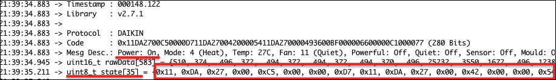

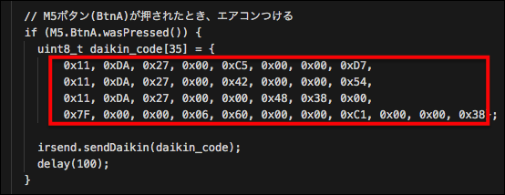
In this sample code, line breaks are inserted for easy reading. It works properly even with line breaks.


* Open the sketch editor from Arduino IDE “File” → “New File”. Delete the code displayed below.
* Paste IRsendDemo_DAIKIN.ino with the rewritten infrared command pattern into the sketch editor.
* Click the "→" icon at the top left of the sketch editor to write to M5StickC.
* When asked where to save the file on the Mac, specify it appropriately. (It is better to save it in that location without changing it.)
* Wait several tens of seconds for writing.
* The installation log is output in the lower half of the sketch editor and the message "Hard resetting via RTS pin ..." appears.
* Disconnect the USB cable and bring the M5StickC within 50 cm of the air conditioner. Leave the infrared transceiver unit on the M5StickC without disconnecting it.
* Press the large button "M5 button" next to the LED on the M5Stick and the air conditioner should be turned on.

If the air conditioner does not respond, try moving the M5StickC closer to the air conditioner. When power is not supplied by USB cable, it may not respond unless it is close to 50cm.


#### How to test infrared rays Tips

Infrared rays are invisible to the eye, which makes debugging difficult.


If you press the M5 button but the home appliance doesn't respond, it's hard to tell if the infrared is weak and you need to get closer, or if you don't have a signal.

In such a case, you can see if you capture the “infrared output side” of the infrared transmitting / receiving unit connected to M5STickC with the front camera of the smartphone that has a face authentication function.

Below is a picture taken with iPhone X. Even if you do not take a picture, you can capture it with the camera lens. When you look at it while holding down the M5 button, you can see a faint violetish glow.

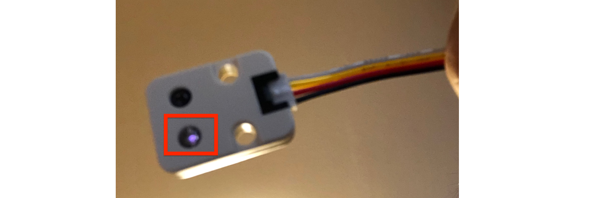

#### For manufacturers other than Daikin

Thankfully, there is sample code on GitHub, the author of the IRremoteESP8266 library.

https://github.com/crankyoldgit/IRremoteESP8266


However, this is not clear enough, so here are a few helpful blogs that are very helpful.

* Use infrared remote control with M5StickC (NEC example) Masayuki Tanaka @<br>{}
https://lang-ship.com/blog/?p=886

* Make a home appliance remote control that can be operated from a smartphone with M5StickC (NEC example) @elchika @<br>{}
https://elchika.com/article/218f5072-28a6-461c-a801-43390305f4cc/

* Make infrared remote control with M5Stick-C (Fujitsu example) @poruruba @<br>{}
https://qiita.com/poruruba/items/34220a4dd6aaf48392aa

* I transmitted and received infrared remote control data with M5StickC. (Example of Panasonic) RESEARCHER @<br>{}
https://lab.sasapea.mydns.jp/2019/06/28/m5stickc-ir/


* Make M5StickC an infrared remote control (example of various TV manufacturers)
https://kuratsuki.net/2019/07/

//embed[latex]{
\clearpage
//}

## Adafruit MQTT settings

MQTT is a lightweight data distribution protocol of the Pub/Sub type data distribution model by TCP/IP.
It is a mechanism that allows you to send commands safely to IoT devices in networks such as homes and factories when you want to send commands from outside.
However, if you do not pay attention to security, it may be that someone else has been heating up your house without permission.
So, this time, I will use Adafruit's MQTT, which is free but can use the user authentication function.


* Go to Adafruit https://io.adafruit.com/ and create an account.
* Enter the following in "Actions" → "Create a New Dashboard".

```
Name: voiceflowIRDev
Description: For development
```

* Input the following in "Feeds" -> "View All" -> "Actions" -> "Create a new feed".

```
Name: daikin_onoff
Description: Daikin infrared remote control for spoofing
 * If the manufacturer is different, please change it to your own easy-to-understand name / description.
```

* "Feeds" → "View All" → "daikin_onoff" → "Feed Info"
* The following screen opens, and copy the MQTT Topic displayed under "MQTT by Key" to Notepad.

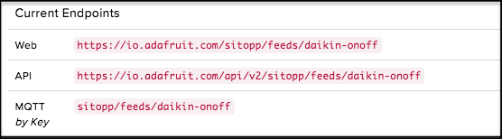


* Access the following URL and check the server information of ```MQTT broker```

https://io.adafruit.com/api/docs/mqtt.html#mqtt-connection-details

```
Host io.adafruit.com
Secure (SSL) Port 8883
Insecure Port 1883
** MQTT over Websocket 443
Username Your Adafruit IO Username
Password Your Adafruit IO Key
```

Username / Password is different for each person. Also, it is different from the user account of ```https://io.adafruit.com/```.
Click on the ```AIO Key``` on the right shoulder of the dashboard to view it, so be sure to check it.

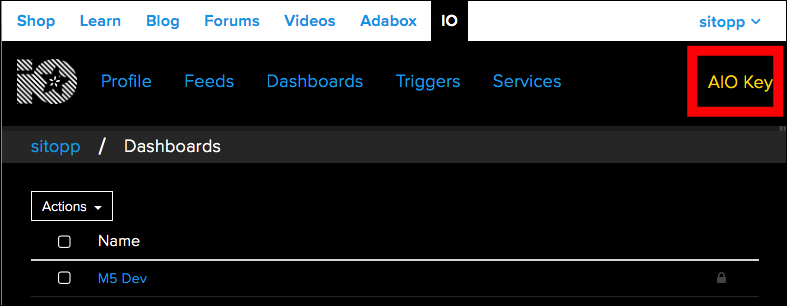

//embed[latex]{
\clearpage
//}

## Make a simple MQTT publisher with IFTTT

When you access the URL issued by Webhooks, you create a mechanism to publish a Topic to Adafruit's ```MQTT broker```.

* Log in to IFTTT ```https://ifttt.com/```
* Create if you do not have an account.
* Click the human icon at the top right → Click “Create” from the pull-down menu.
* Click "This" on the "Create your own" screen.
* Input "Webhooks" in the input field "Search services" → Click the displayed "Webhooks" panel.
* If you are a first-time user, click the “Connect Webhooks” screen.
* Click the "Receive a Web request" panel → Event Name: Enter "```M5StickCIRRemoCon```".
* Enter "Adafruit" in "Create trigger" → "That" → "Search services".
* Click on the "Adafruit" panel that appears.
* (In the case of the first use) The screen "Connect Adafruit" is displayed. Click "Connect". Scroll down on the pop-up screen and click "AUTHORIZE" under "Authorize IFTTT".
* Click the "```Send data to Adafruit IO```" panel.
* From the "Feed name" options, select the Feed registered with Adafruit, "```daikin_onoff```".
* Click "Add ingredient" at the bottom right of "Data to save" and click EventName.
* Click "Add ingredient" again, then click on Value1, Value2, Value3.
* "Data to save" becomes "```{{EventName}} {{Value1}} {{Value2}} {{Value3}}```".
* Click “Create action” → “Finish”.

The applet is now complete. Click "settings" at the top right for details.

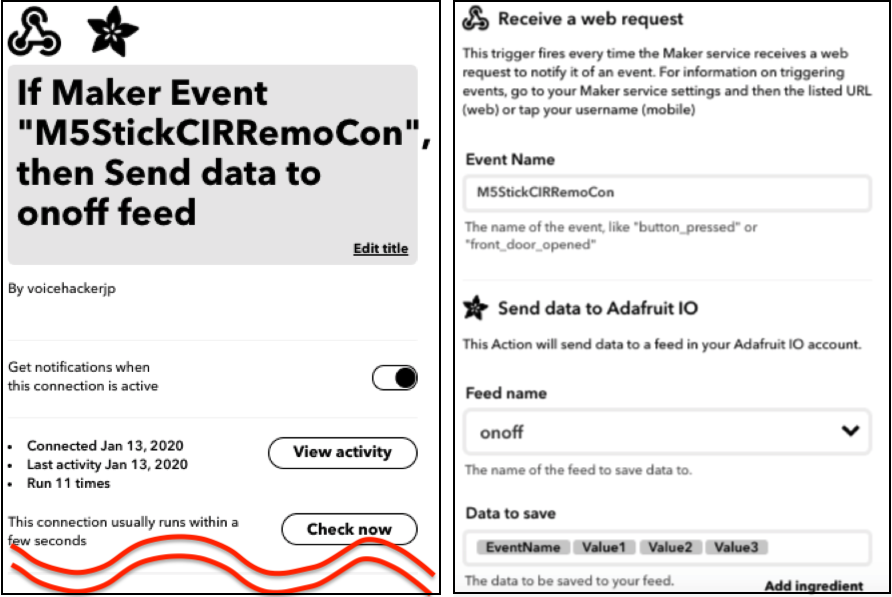


#### Check the URL issued by Webhooks

It will be called from Voiceflow later, so let's check it out.

* Access IFTTT's "My Services" on Chrome. ```https://ifttt.com/my_services```
* Open "Webhooks" → "Documentation".
* Enter "```M5StickCIRRemoCon```" in the URL ```{event}``` under "```Make a POST or GET Web request to```".
* Copy the URL starting with ```https://``` and write it down in Notepad. @<br>{}
Example) URL: https://maker.ifttt.com/trigger/M5StickCIRRemoCon/with/key/ (Omitted)

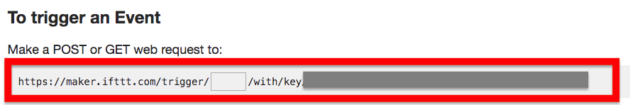


## Create Actions On Google with Voiceflow

If you are new to Voiceflow, please go through "1.2 How to Use Voiceflow" at the beginning of this book, and then proceed as follows.

### Creating a flow

* Access voiceflow in Chrome and log in. https://www.voiceflow.com/
* Click "create Project" → Enter the Actions name in "Enter your Project name".
* In this article, the Actions name is "Shoinji". @<fn>{sitopp_actionsname}


//footnote[sitopp_actionsname][Actions name is not public, so anything is fine. This year's M-1 Pokopo was interesting, so I'll use it in this article. Please replace it with your favorite name.]


* Check "Japanese" on the Select Regions screen and uncheck "English (US)".
* Click "create Project" to start creating a project and open the Design screen when you can.

From here on, I will explain in detail with screenshots.


#### Creating a Speak block that speaks the "Welcome" part

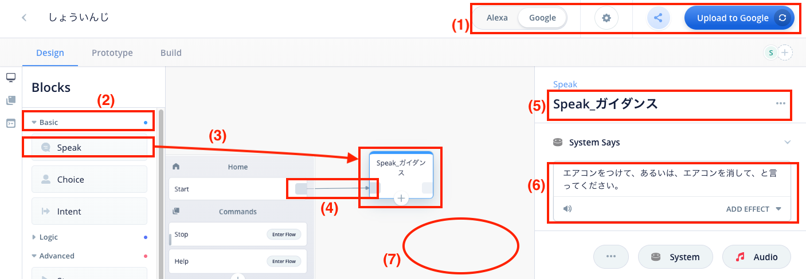

This is the basic usage of Speak block. @<br>{}
(1) Slide the "Alexa Google" switch on the header to "Google". @<br>{}
Confirm that the "Upload to Alexa" button changes to "Upload to Google". @<br>{}
(2) Click “```▶ ︎Basic```” in the “Blocks” menu to open it. @<br>{}
(3) Click "Speak" and drag it to the right margin of the block marked "Home". @<br>{}
(4) Draw a line from the right end of the “Start” line of the Home block and connect it to the left side of the Speak block. @<br>{}
(5) Click the Speak block, and the input field will pop out from the right, so click the second largest character "Speak" from the top and overwrite it with "```Speak_Guidance```". @<br>{}
(6) Enter "Please turn on the air conditioner or turn off the air conditioner" in the entry field under "System Says". @<br>{}
(7) Click the margin in the center editor to close and save the editing window in the right pane. @<br>{}


#### Creating Intent Block to Pick Up Utterance

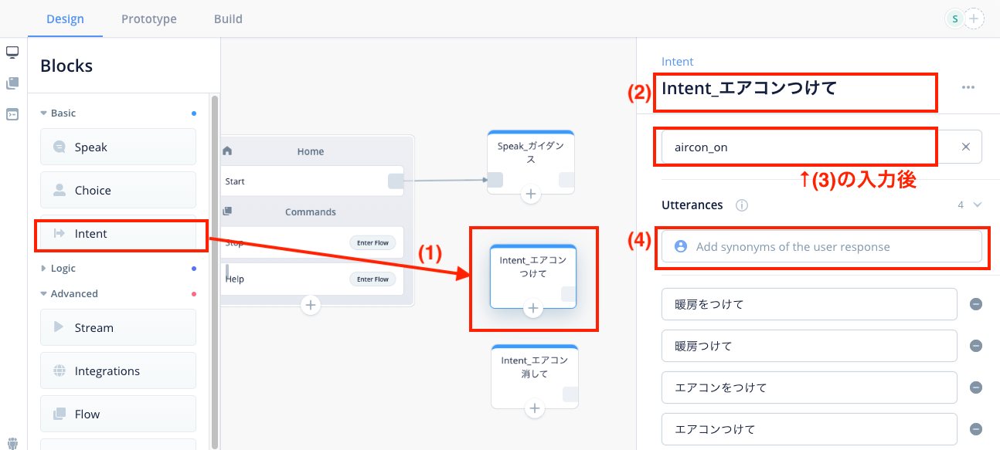

A block to turn on the air conditioner and pick up utterances. I will make them together for each meaning. @<br>{}
(1) Click “```▶ ︎Basic```” in the“ Blocks ”menu to open it, and drag “Intent” under “```Speak_Guidance```”. @<br>{}
(2) When you click the Intent block, the input field pops out from the right, so click the second big descriptive character from the top, "Intent" and overwrite ```Intent_attach_air_conditioner```. @<br>{}
(3) Click “Name new intent or select existing intent”. @<br>{}
Click "Name new intent", enter "```aircon_on```", and click "Create". @<br>{}
(4) Click “What might the user say to invoke this intent?” Under “Utterances” and enter “Turn on” and enter. @<br>{} @<fn>{sitopp_danbo}
Click "Add Synonyms of the user response", enter "Turn on heating" and enter. @<br>{}
Enter "Turn on the air conditioner" and enter. @<br>{}
Enter "Turn on the air conditioner" and enter. @<br>{}
(5) Click the margin in the center editor and close the editing window in the right pane. @<br>{}
Note) The left side to the Intent block does not connect the line from anywhere. @<br>{}

Similarly, make a part to turn off the air conditioner.

* Click "```▶ ︎Basic```"in the "Blocks" menu to open it, then drag "Intent" under "```Speak_Guidance```".
* Click the Intent block to display the edit field, and click the second largest "Intent" from the top to overwrite with "```Intent_Turn_off_air_conditioner```".
* Click "Name new intent", enter "```aircon_off```", and click "Create".
* Enter "Heating" in the entry field under "Utterances" and enter.
* Similarly, enter "Turn off heating" and enter.
* Similarly, enter "Turn off the air conditioner" and enter.
* Similarly, enter "Turn off the air conditioner" and enter.
* Click the margin in the center editor to close the editing window in the right pane.

//footnote[sitopp_danbo][I thought it would be nice to add a cooler when thinking of summer, but please forgive me because the room was cold and it wasn't right. ]


#### Parameter declaration


To make the flow cleaner, we will use parameters. @<br>{}
(1) Click the third icon "Variables" from the top of the ultra-thin pane on the left of the Design screen. @<br>{}
(2) Enter “device” in the “Create Variable (Project)” input field and enter. @<br>{}
(3) "```{device}```" is added at the end of the Variables list. @<br>{}
(4) Add ```{onoff}``` as well. @<br>{}

#### Creating a set block to route parameters

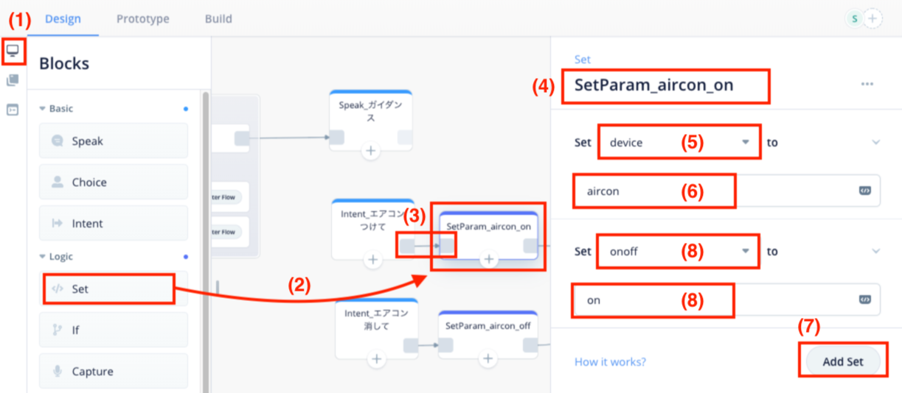

The Set block can set parameters. @<br>{}
(1) Click the icon “Blocks” at the top of the ultra-thin pane on the left of the Design screen. @<br>{}
(2) Drag the “▶ ︎Logic” → “Set” block to the right of “``` Intent_ Turn on the air conditioner``` ”. @<br>{}
(3) Connect a line from the right side of "``` Intent_Turn on air conditioner``` ". @<br>{}
(4) Click the set block to display the edit field, click the second largest character "Set" from the top and overwrite it with "``` SetParam_aircon_on``` ". @<br>{}
(5) Click the “Select Valiable” option and specify “device” at the bottom of the list. @<br>{}
(6) Enter “aircon” in “Value”. @<br>{}
(7) Click “Add Set” to add a second input field. @<br>{}
(8) Specify “onoff” for “Select Valiable” and enter “on” for “Value”. @<br>{}

Similarly, make a Set block to turn off the air conditioner.

* Right-click the "```SetParam_aircon_on```" block and select "Copy Block".
* Right-click on the margin below the "```SetParam_aircon_on```" block and select "Paste". 
* Click the duplicated block to display the edit field, click the second bigger character from the top, "```SetParam_aircon_on```", and overwrite it with "```SetParam_aircon_off```".
* Click "^" to the right of "Set onoff to" and overwrite it with "off" when "on" is displayed.
* Connect a line from the right side of "```Intent_Turn off the air conditioner```".

#### Creation of Integrations block for calling external API

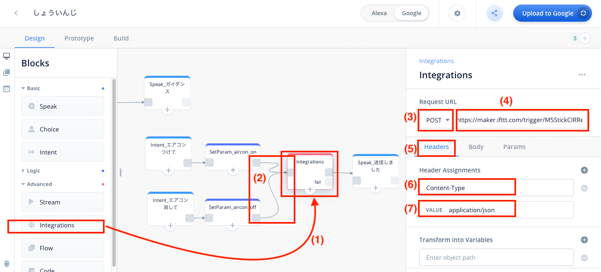

Integrations block can be linked with API and GoogleSheet. @<br>{}
(1) Drag “▶ ︎Advanced” → “Integrations” to the right of “```SetParam_aircon_on```”. @<br>{}
(2) Put out a line from the right side of "```SetParam_aircon_on```" and connect. Similarly, draw a line from "```SetParam_aircon_off```" and connect. @<br>{}
Click the Integrations block to open the settings screen. @<br>{}
Click “Custom API”. @<br>{}
(3) Click “GET” under “Request URL” and select “POST” from the options. @<br>{}
(4) Enter the URL issued by IFTTT's Webhooks. @<br>{}
(5) Click “Headers” in “Headers Body Params” under it. @<br>{}
(6) Enter “Content-Type” in “Enter HTTP Header” of Header Assignments. @<br>{}
(7) Enter “application/json” in Value. @<br>{}


#### Creation of Integrations block for calling external API-continued

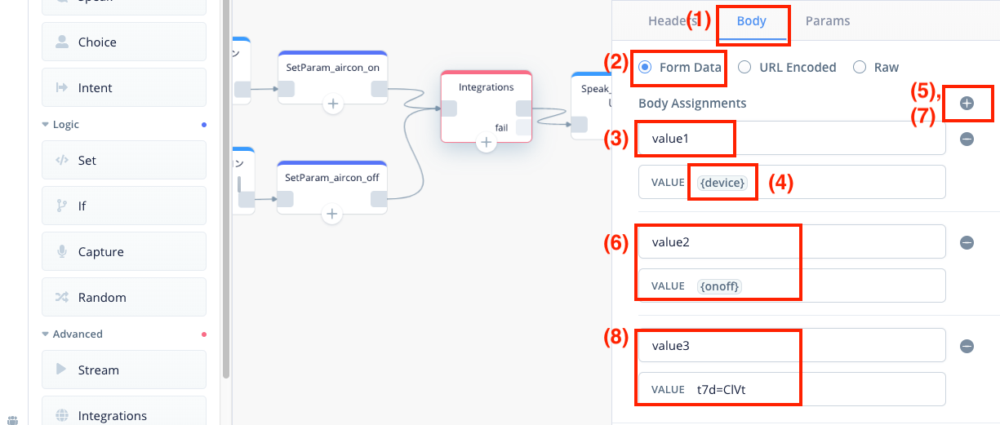

In addition to the type of home appliances and on / off, pass a string for authentication. @<br>{}
(1) Click “body” of “Headers Body Params”. @<br>{}
(2) Click “Form Data”. @<br>{}
(3) Enter “value1” in “Enter key” of “Body Assignments”. @<br>{}
(4) Enter “{device}” for “value”. @<br>{}
(5) Click + on the right side to add an input field. @<br>{}
(6) Enter “value2” for “Enter key” and “{onoff}” for “value”. @<br>{}
(7) Click the + on the right again to add an input field. @<br>{}
(8) Enter “value3” in “Enter key” and **any password** in “value”. Do not use {}. @<br>{}
Note) In this example, 8 characters of "t7d=ClVt" are used. Please fill in the string that is unknown to others.
It is better to close your eyes and hit the keyboard or use an automatic password generation site.
From now on, the explanation will proceed as "t7d=ClVt", so please replace it with your own passphrase. @<br>{} @ <br> {}

Next, create a block that tells you that it's done. There is no session, so please read the explanation carefully and proceed.

* Drag the “▶ ︎Basic” → “Speak” block to the right of the Integration block and connect it with a line.
* Click on the Speak block to open the settings screen, overwrite the block name "Speak" with "Speak_Sent" and write "Sent" under "System Says".

#### Choice block added

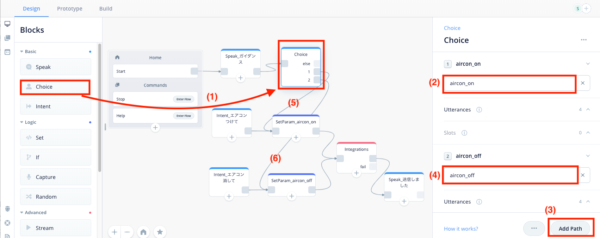

Used to fork a conversation started from the Start block with Intent. @<br>{}
(1) Drag "▶ ︎Basic" → "Choice" to the right of "```Speak_Guidance```", draw a line from "```Speak_Guidance```" and connect it,
Click the Choice block to open the settings screen. @<br>{}
(2) Click the option under "1 path" and select "``` aircon_on```". @<br>{}
(3) Click “Add path”. @<br>{}
(4) When “2 path” is generated, click the same option and select “```aircon_off```”. @<br>{}
(5) Connect a line from "1" in the Choice block to the "```SetParam_aircon_on```" block. @<br>{}
(6) Connect a line from "2" in the Choice block to the "```SetParam_aircon_off```" block. @<br>{}

The flow is now complete. Please take a break and drink coffee (^ p ^).


#### test

(1) Can you POST?

* Click "Test Request" at the bottom right of the input field of the Integrations block.
* When the popup opens, enter "aircon" for "Device" and "on" for "ONOFF", and click "Send Request".
* On the next screen, open the "Raw" tab and read the displayed characters.
* It is OK if "```Congratulations! You're fired the M5StickCIRRemoCon event```" is displayed.
* Otherwise, check the POST URL because it is incorrect.

(2) Flow test

* On the Voiceflow screen, click "Prototype" under "Design Prototype Build" at the bottom of one line of the header.
* Click when the "Start Test" button appears at the bottom right of the screen.
* Enter "Heating ON" in the "USER SAYS" input field, and press Enter.
* If the response does not come back, you may have forgotten the settings of the last Speak block or there is something wrong with the settings so far.


(3) Check IFTTT issue history


* Access IFTTT's My Applet. (```https://ifttt.com/my_applets```)
* Click the created applet "```If Maker Event "M5StickCIRRemoCon", then Send data to onoff feed```".
* Click “Settings”.
* Click the "View activity" button to open the history list.
* If executed normally, there should be a block of "```Applet ran```".
* It is OK if there is a time of "Test Request" in Voiceflow Design and a time of "```Appletran```".
* If there is no history, some error has occurred. There is a high possibility that the URL specified on Voiceflow is different, so review it.


### Upload to Google

* Open the Voiceflow project "Shoujinji" in Chrome and click "Build" in the three "Design Prototype Build" at the top left of the screen.
* Click "Google beta".
* In the list of Languages, click "Japanese (ja)" to make it selected. You can see because the letters are thicker. Conversely, if “English (en)” is selected, click to remove it.
* Click “Next”. Proceed to "Legal", but click "Design" on the upper left to return to the editing screen.
* Click the "Upload to Google" button.

* Click "here" in "Please provide Dialogflow Credentials Setup instructions can be found here".
* Guidance will be displayed, so proceed with this content.

Note) When creating "Test-Project" in DialogFlow, "Japanese-ja" must be specified in DEFAULT LANGUAGE. According to Voiceflow's guidance:


The above guidance has been completed after uploading Json, so I will continue.

* Click the "Upload to Google" button.
* This time the upload ran and completed in about 10 seconds. "Action Upload Successfull" is displayed.
* Click on "You may test on the Google Actions Simulator." To open the simulator.


Now the simulator opens, but there is something to do before testing in the same Actions Console.

* Open "Overview" tab and click "Quick Setup".
* Click "Deside how your Action invoked".
* Make sure that the "Japanese" tab is open and enter "Shoinji" in the "Display name" input field.
* Change the voice to "Male1" because you can change the voice with "Google Assistant voice".
* Click "Save" at the top right.

Now, return to the simulator and check the operation.

* Click "Test" from the upper menu.
* In the input field at the bottom left of the screen, "Connect to the map" is displayed, so move the cursor and press enter.
* "Okay. This is a test version of the song. Please turn on the air conditioner or turn off the air conditioner." Enter and press enter.
* There is a response saying "Sent." And the action ends. OK.

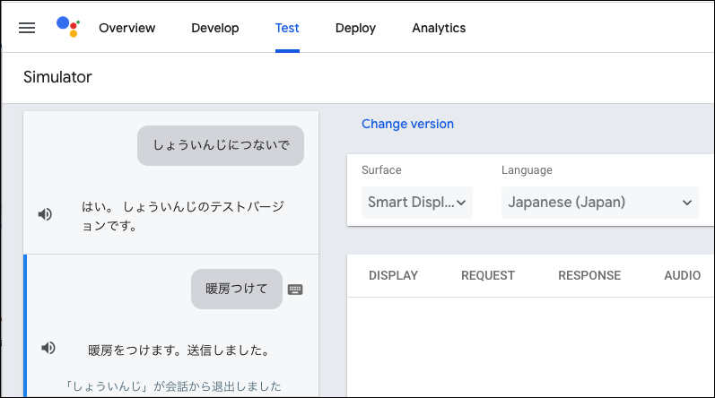

If you get an error, try the following:

* Open Dialogflow console https://dialogflow.cloud.google.com/
* Click the menu icon of the three lines in the upper left, select the project you just created, and click the gear.
* The tab "General Language MLSettings ~" is lined up, so click "Languages".
* Click "Select Additional Language" and select "Japanese-ja".
* Click "SAVE".

Let's test again. Did it move this time?

//embed[latex]{
\clearpage
//}


## Make M5StickC remote control compatible with MQTT

I recommend using Adafruit's thankful MQTT library.

* Open Arduino IDE, go to "Sketch"-> "Include Library"-> "Manage Library"-> Search "Adafruit_mqtt" in the filter field, and install the displayed one.
* Open the sketch editor from "File" → "New File". The code displayed below is deleted.
* Copy the code I wrote from Guthub and paste it into the sketch editor.

```
URL: https://GitHub.com/sitopp/vf_techbookfest8_sampleCode
File path: M5StickC/IRsend_DAIKIN_MQTT_forM5StickC.ino
```

* Rewrite the Wifi account on lines 10-11 to your own.
* Replace the Adafruit user information on lines 17-18 with the one you obtained earlier.
* Replace the infrared patterns on lines 79-85 and 91-97 with the ones collected earlier.

```
10 #define WLAN_SSID "" // WiFi SSID
11 #define WLAN_PASS "" // WiFi password
(Omitted)
17 #define AIO_USERNAME "" // Username of Adafruit
18 #define AIO_KEY "" // Active Key of Adafruit
(Omitted)
79 uint8_t daikin_code [35] = {
80 0x11, 0xDA, 0x27, 0x00, 0xC5, 0x00, 0x00, 0xD7,
81 0000, 0000, 0000, 0000, 0000, 0000, 0000, 0000,
82 0000, 0000, 0000, 0000, 0000, 0000, 0000, 0000,
83 0000, 0000, 0000, 0000, 0000, 0000, 0000, 0000, 0x00, 0x00, 0x39};
84 // Dummy. Rewriting to your own remote control signal
85 irsend.sendDaikin (daikin_code); // different class for each manufacturer
(Omitted)
91 uint8_t daikin_code [35] = {
92 0x11, 0xDA, 0x27, 0x00, 0xC5, 0x00, 0x00, 0xD7,
93 0000, 0000, 0000, 0000, 0000, 0000, 0000, 0000,
94 0000, 0000, 0000, 0000, 0000, 0000, 0000, 0000,
95 0000, 0000, 0000, 0000, 0000, 0000, 0000, 0000, 0x00, 0x00, 0x39};
96 // dummy. Rewriting to your own remote control signal
97 irsend.sendDaikin (daikin_code); // Class is different for each manufacturer
```

* Click the “→” icon at the top left of the sketch editor and write to M5StickC.
* You will be asked for the storage location, so specify it appropriately.
* Wait several tens of seconds for writing.
* Click "Tools" → "Serial Monitor" to open the window.

#### IFTTT ~ MQTT ~ M5StickC binding test

Let's test the integration using the Test tool included with IFTTT's Webhooks.

* Access IFTTT's "My Services" on Chrome https://ifttt.com/my_services
* "Webhooks" → "Documentation"
* Enter "M5StickCIRRemoCon" in the {event} of the URL under "Make a POST or GET Web request to:".
* Enter the following in "With an optional JSON body of:".

```
{"value1": "aircon", "value2": "on", "value3": "t7d = ClVt"}
```
* Click "Test It".
* Confirm that the following message is displayed on the serial monitor.

```
19: 26: 32.531-> On-Off button: M5StickCIRRemoCon aircon on t7d = ClVt
19: 26: 32.568-> Passed on
```

Next, let's check "Off".

* Changed "value2": ** "on" ** in "With an optional JSON body of:" to "value2": ** "off" **.
* Click "Test It".
* Confirm that the following message is displayed on the serial monitor.

```
19: 26: 37.849-> On-Off button: M5StickCIRRemoCon aircon off t7d = ClVt
19: 26: 37.886-> pass off
```

* Remove M5StickC from the USB cable and place it within 1m of the air conditioner. The infrared unit remains connected to M5StickC.
* Send an on / off signal from Chrome's IFTTT Webhook test tool to check if the air conditioner is on / off.

The air conditioner should be stuck near the ceiling, so if you put M5StickC on the floor, the distance from the air conditioner to the floor will exceed 1m. Please stick it on the wall with packing tape.
The M5StickC has a battery inside, so it works even if you unplug the charging cable for a few minutes (~ a few hours).


#### Connect everything and check operation

Let's run it from the Actions On Google console.

* Open in Chrome. (https://console.actions.google.com/)
* "Test"-> "Connect to Shojiji" is displayed in the input field on the lower left, so click it and press enter.
* If you get a response saying, "OK, this is a test version of the Shojiji. ~", Enter "Turn on air conditioner" or "Turn on heating" and press enter.
* After reading out the man's voice saying "Sent", the air conditioner turns on one second later.

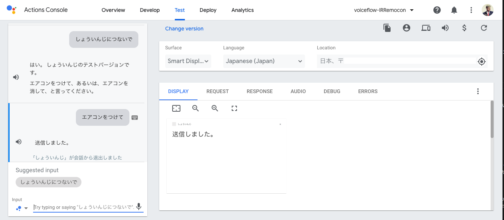


If it works, try it from the actual device.

If you have Google home, Google Home Mini, Nest Hub, etc., please log in with the same Google account used for development.

* "Ok Google, please call me," and said, "Yes, this is a test version of the game."
* If you ask "Turn on the air conditioner", it responds "Sent."
* Call out again, "Ok Google, call me." "Yes, this is a test version of Shoinji."
* If you ask "Turn off the air conditioner", the air conditioner stops responding with "Sent."


If you don't have an actual device at hand, you can of course use the ```Google Assistant app```.

* Install ```Google Assistant App``` on your iPhone or Android smartphone.
* Launch the application, tap the microphone icon and say "call me!"
* Speak “Turn on the air conditioner” or type in a text to turn on the air conditioner.
* If you say "Turn off the air conditioner" or type a text, the air conditioner stops.

When using the ```Google Assistant app```, it is convenient to be able to give commands using voice or text.

This completes one of the functions.

In addition, I think that the range of infrared rays sent from the M5StickC + infrared unit is about 1 meter and 50 cm, so if you think it doesn't move, bring it closer and try.


//embed[latex]{
\clearpage
//}

## Try to support Amazon Alexa

For those who want to try it on Amazon Echo, we will explain how to make the flow for Google Assistant compatible with Alexa.

** The flow created this time will work on Alexa without any modification. This is the great thing about Voiceflow. ** It is OK if you only create and link an Alexa account, so let's do it quickly (^ p ^)

#### Creating an Alexa Developer Account
If you don't have one yet, create one. @<br>{} @ <br> {}
Actually, there is a point that you can easily make a mistake when creating an account, but the explanation written by Alexa Evangelist Mr. Hatanaka is very easy to understand, so it is absolutely OK to do it while reading it. @<br>{} @ <br> {}

Alexa Developer Account Creation Tips @<br>{}
https://developer.amazon.com/ja/blogs/alexa/post/@<br>{}
9f852a38-3a44-48bd-b78f-22050269d7c7 / hamaridokoro


#### Upload to Amazon from Voiceflow

* Access Voiceflow with Chrome and open the "Design" screen.
* Switch the "Alexa" and "Google" sliders in the header to "Alexa".
* Press the Upload to Alexa button.
* Since it is required to link with the developer account, proceed as shown on the screen.
* When the "Upload Successful" pop-up appears, click "Test on Alexa Simulator".

If you get an "Error 404" message when you click "Test on Alexa Simulator", click around the "alexa developer console" logo in the upper left, log back in with your Alexa developer account, and then try again Return to the Voiceflow screen and click on the "Test on Alexa Simulator" link.


* Enter "Open the dictionary" in the input field of "Input or press and hold microphone" and enter.
* The Alexa simulator responds, "Please turn on the air conditioner or turn off the air conditioner."
* Enter "Turn on air conditioner" in the input field of "Input or press and hold microphone" and enter.
* Alexa simulator says "Sent." And confirms that the remote control works.

As a result of the conversation so far, you should see the following exchanges on the simulator.

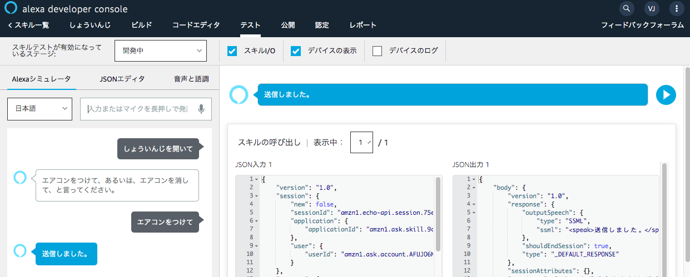


If it works well on the simulator, try it on your Amazon Echo device.

* Install the ```Alexa app``` on your iPhone or Android and log in with the same Amazon account as the Alexa developer account you used above.
* Open the hamburger menu at the top left of the app → “Skills / Games” → “Effective Skills”.
* Tap "Development" and confirm that the skill "Shoinji" exists.
* Call the actual machine such as Amazon Echo "Alexa, open the scene".
* Amazon Echo responds, "Please turn on the air conditioner or turn off the air conditioner."
* So, ask "Turn on the air conditioner."
* Remote control should work after Amazon Echo responds "Sent."


That's all for hands-on. Did it move safely? @<br>{}
There may be differences depending on the environment, and there may be parts that are different from the version when writing the manuscript, so I hope that you can try it out while googled.

//embed[latex]{
\clearpage
//}

#### Finally

Before I met Voiceflow, I worked hard on Alexa skill code, wrote it in Node.js and uploaded it to Lambda. However, at Alexa's hackathon in July 2019, there was a sad event that the development speed was originally low and the lack of sleep on the previous day made it almost impossible to write code. As I was young, I realized that I was writing code (I envy young people (^ o ^;)), and then started using Voiceflow to listen to rumors. @<br>{} @ <br> {}
If you do that, you will be able to make it overwhelmingly fun, and of course you do not have to write complicated skills, but I can do enough for simple skills such as workouts I am making (^ p ^ ). ** What was it until now (^ p ^) ** @<br>{}
At the same time, I began to look beyond Alexa skills. I hear that designers can now make Alexa skills on Voiceflow themselves. For me it was electronic work like this manuscript and Actions On Google. @<br>{} @ <br> {}
And electronic work. I like VUI, so I'm working hard to learn how to add voice control to various things, but I'm struggling because I have no basic knowledge of electrical systems. Professional people are amazing. So, I wonder if it may be said that it is another power application, and I opened it again as much as possible, and dragged as many hardware developers and embedded engineers as possible into the ** VUI swamp ** to take along with me, I want to make things together (^ p ^). Sound fun! @<br>{} @ <br> {}
Voiceflow does all the work of building a server around the web and uploading it to Google instead, so it's perfect for those who aren't good at the web to try it out. Of course, a more formal procedure is required when commercializing, but I think it is very convenient when making a prototype. @<br>{} @ <br> {}
Eventually, we hope that voice control will become a natural world, like the ```Computer of the Star Trek Enterprise No.``` and the Knight Rider Knight 2000. @<br>{} @ <br> {}
Yes, then, "** Engage! **"


@sitopp worship


