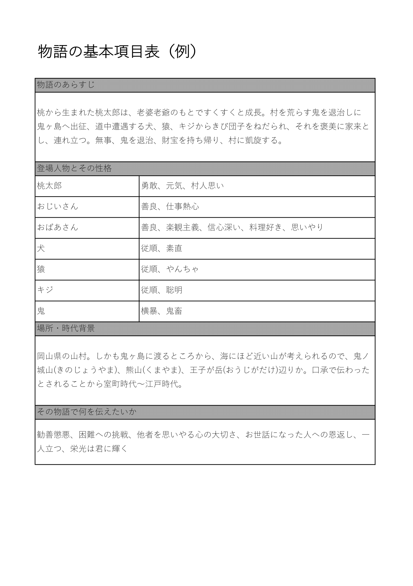
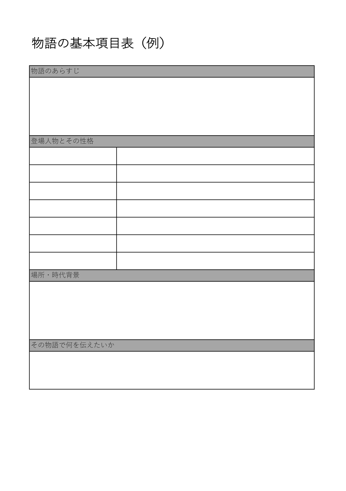
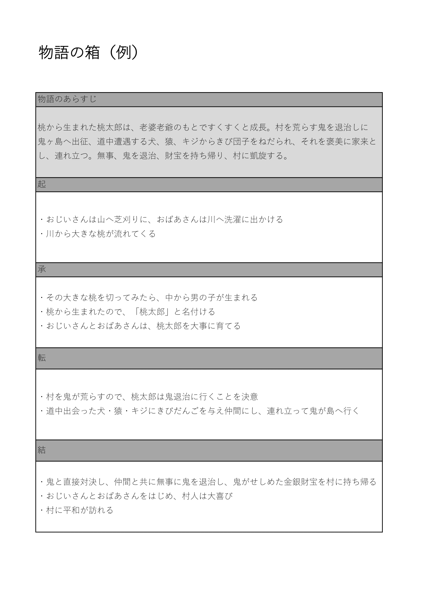
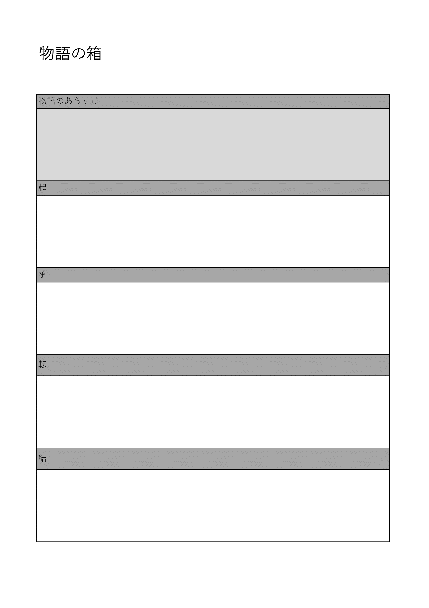
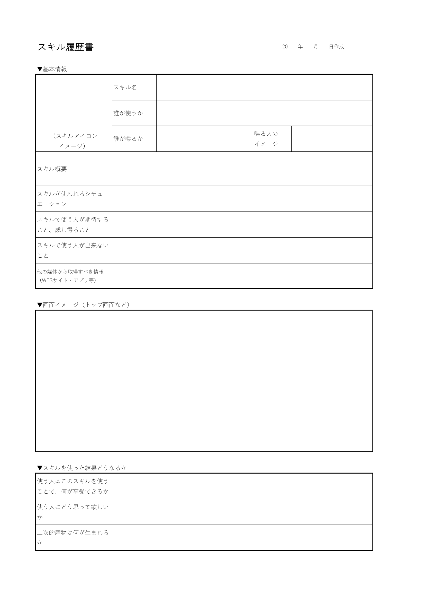

# Tips for using narrative skills with Voiceflow

## Introduction to this chapter

In the chapters so far, it has been said that Voiceflow fierce people who are famous in various Voice UI neighborhoods have been doing wonderfulness of Voiceflow, ease of use, habits when using it, how to overcome it, points of insight, etc. I know

In this chapter, Voice UI / UX designer Rie Motoki will share with you the tips of creating a "telling a story" skill that is finding a way out personally in the future.


## Why are you finding a way to tell your story?

### "Listening" is the period of user growth

I have been a founding member of the Voice UI department since its launch.
The company decided that Voice UI was an important area to launch as its own new business, and established the Voice UI Department in April 2018.


At the beginning, we positioned R & D and provided a lot of skills when launching each platform. Anyway, I thought out of the members of the department and listened to the needs of the platformers, and have produced more than 20 different skills for the company's new business and for the future of Voice UI. @<br>{}


I've been steadily accumulating achievements in this way, and as of January 2020, when I am writing this, I feel that Voice UI will take a little more time to surpass chasm in the world. @<br>{}


It's not hard to imagine that there are many literate users, "Alexa? What's so tasty?", Especially because they are developing content-specific skills, especially for the entertainment of in-game characters for women.
Of course, there are female users who are familiar with gadgets, but there are still few. @<br>{}

Also, even engineers who came to the technical book sale party that bought with interest in smart speakers said that `` I use smart speakers only for news and weather, and only for listening to radio '' surprisingly There are many. @<br>{}

There are many definitions of Voice UI, but the Voice UI discussed in this chapter is not limited to smart speakers.

This is defined as Voice UI, where humans operate all things and things, such as home appliances and machines, by voice. @<br>{}

Everywhere in our environment, the number of things that humans can control by voice will increase. It is the not-so-distant future.

However, as of January 2020, the future has not yet come. The current status and reality of Voice UI in Japan has not yet exceeded chasm. @<br>{}

Alexa's number of skills in Japan exceeded 3,000 in October 2019, and the number of contents provided is being enhanced. On the other hand, the number of users and the literacy of users have not yet caught up. @<br>{}

Of course, it's not the user.

I think that the major reason is that we have not been able to provide content with quality that exceeds the chasm.
As a company that plans and develops skills, we look back and reflect on it, and we are experimenting every day to find out what is needed to further advance Voice UI. @<br>{} @ <br> {}

In a guest talk session at `` Alexa Skill Learning Day '' held at Amazon in December 2019, Voice Up Lab who is sending a lot of skills in the Voice UI industry to the world said I was @<br>{}

"The creator wants to talk to various users and builds skills, but the user wants to listen." @<br>{}

After hearing this, I felt, "This is the solution at the moment." @<br>{}

Assuming this as a hypothesis, when thinking of a skill that can fully demonstrate the act of "listening", I who is passionate about entertainment reminded me of "listening to the story" first. @<br>{}

That's why we think that "telling the story" skills may be the right fit for the growing user market today. @<br>{}


//embed[latex]{
\clearpage
//}

### Smooth transition from passive to active behavior

At this point, assuming that users don't require Voice UI to do more than "listen", how do we and third party and individual skill developers build their skills? @<br>{}

The "telling a story" skill is one of the solutions, but simply telling a story will not grow your users. @<br>{}

Users will be able to more spontaneously talk to the smart speaker and enjoy the experience of responding to it, and you will be able to realize the appeal of Voice UI for the first time. @<br>{}

Then come up with "Gamebook style story skills". @<br>{}

If you are in your late thirties or early forties, you probably know a paperback or comic book size book called a "game book".

As you read through the story, you will be presented with choices, and as you go through the selections, you will have enjoyed a book whose outcome depends on your choices. @<br>{}

Why not bring that gamebook experience to your skills? @<br>{}

While listening, they answer their intentions in a voice, and the experience changes in response.

It creates a smooth transition from passive listening only to active behavior. @<br>{}


To bring the gamebook experience to your skills, let me tell you a little more about the story and what you learned and what I learned.


## A story is a structure

### What I looked for as a drama or movie writer

About ten years ago, there was a time when I was seriously thinking about what I wanted to do, other than what I was doing.

The thoughtful thought came to the writer of the movie or drama. @<br>{}

Why did you want to be a scriptwriter? The reasons are as follows. @<br>{}

* I love movies and dramas.
* I loved reading novels.
* I liked writing rather than suffering.

In particular, the reason I like writing is supported by my "summary personality." @<br>{}

I was able to write any number of reading impressions simply by explaining the back cover and oblique reading.

In addition, university reports are a lot easier than studying until high school, because they pull textbooks and library literature, extract important points and summarize what they think about them, and give credits. I felt so. @<br>{}

If I do my "like" work, I guess there is only a writer. @<br>{}

I came to think so. @<br>{}

For one year, I spent two years a week between work and two times a week, but unfortunately, I couldn't be a writer. @<br>{}

The writer is not a job profession just because he attended the course.

Luck, ability, and the ability to read the times must accompany. And none of them were enough for me. @<br>{}

However, the experience gained in the course is very useful now that I have entered the role of Voice UI / UX Designer.

Above all, it was the best harvest to be thoroughly taught that "story is structure".

Until then, the screenwriters always thought it was a literary work. I believed that the only humans who could write memorable lines were novels, dramas and movies. @<br>{}

However, if the story is not assembled well before that, it will be impossible to write a work that will attract viewers. @<br>{}

It's not just about movies and dramas.

We can conclude that every story in the world is structured.

It asserts that the same is true for narrative skills in Voice UI.


//embed[latex]{
\clearpage
//}


## What is the story structure in Voice UI?

"Even if it's called structure, how can we make a story ..." @<br>{}

I can hear such a voice.

Let's finally unravel the structure of the story that was in Voice UI. @<br>{}


### Fill the story basics

I made a basic item list to make a story. This sheet contains basic information that is the most important part of the story.

This can be used to branch off existing stories or to create new ones.

As an example, we chose "Momotaro" (public domain) for the existing story for clarity. @<br>{}





* Synopsis of the story

The synopsis of the story is the spine of the human body.

Write a short sentence about the story. @<br>{}


* Characters and their character

Please briefly write the characters of the story and their personalities, again in short sentences. @<br>{}

* Location and historical background

Please describe the place where the story unfolds and the historical background.

This time, "Momotaro" is mentioned as an example, but in the case of an existing story (public domain), look up information from the literature and the Internet.

If it's an original story, please write down the place and historical background you decided. @<br>{}


* What you want to tell in the story

What do you want to tell in the story?

The reason for keeping it within 10 is that it is easy to blur what you want to convey if there are too many. @<br>{}





### Let's make a box from the story outline

After filling in the basic items, we will divide the outline of the story into small boxes.

A box is a block that holds the gist of a story. @<br>{}

This time, it is easy to understand, but it is composed of four parts, "Kyosei-Katsu", but some stories do not apply to "Kyo-Katsu". In that case, please freely rewrite the items in the table in this box. @<br>{}


In the box, write important points of the story in a bulleted list.

When / Who / What happens? Let's briefly write the event that will be the point. @<br>{}

In a story that everyone knows like this example, “Momotaro”, it is a form of reverse lookup, but this is quite difficult.

However, after trying a few things, you will gradually get used to it. Try to do the numbers. @<br>{}







### Let's add a branch to the story

If you leave this example of "Momotaro" as it is, it will be a story of "Momotaro" that everyone knows well, and it will not be a gamebook format, so let's add a branch at this timing. @<br>{}

There is a hint in the box on how to add a branch.

There is no doubt that everything written in the box is considered a branching point.

The place where the narrative moves greatly is the place where the branch is set. @<br>{}

For example ...

* "Ki" of the origination transfer

Grandfather is weak and grandmother is strong. It is more appropriate for grandmothers to go lawn to the mountains. In that case, the peach is found by the grandfather who went to the river for washing. @<br>{}

* "Consent" of start and transfer

Momotaro was moribund at the time of birth. The grandfather and grandmother were fine with the care of Momotaro in desperation. This will help Momotaro grow even more, and Momotaro will deeply appreciate his grandfather and grandmother. @<br>{}

* "Start" to "End"

Momotaro decides to go to Onigashima, but sets up a strategy, and only his dog is the first to get on. Dogs are good at negotiations and are not good at fighting, so they decided to negotiate with the demons using their brains instead of power. Negotiations are concluded with the demon, and half of the treasure is returned and welcomed by the villagers. @<br>{}


Thus, for each story box,

"What would happen if the situation surrounding this person was this?"

"What would this person do in such a deployment?"

By expanding the imagination, the story will be sufficiently different from the existing story. @<br>{}

The end of the story, both happy and bad, should be made as you wish.


### Write a skill resume

Here, let's make a resume as a skill. @<br>{}

Apart from making a story, you also need a resume when creating skills.

The details of the resume of the skill are described in "Smart Speaker App Product Description", but in recent years there are new devices with screens and some items have been revised as items, so let me introduce here as well You will. @<br>{}


Users see voice assistants as personalities.

Characters, voice actors, actors and idols have the impression that the original user feels.

What is the personality of voice assistants facing users?

What impressions do characters, voice actors, actors, and idols give?

Write it all out. @<br>{}

Whether narrating with Alexa's voice or using characters, voice actors, actors, and idols, it is recommended that you first create a "resume" of what skills you will create. @<br>{}

It's best to do this carefully, especially if you create a new character to create skills.

Because of this personality, I do not say such things, because I have such habits, I tend to act like this ... By visualizing what I know in my head, it becomes a common recognition of all the creators. @<br>{}


If you get lost on the way back to this resume, you can recall the origin of what kind of skill you were trying to make. @<br>{}


If the policy changes in the middle, modify this "resume" and keep it in sync with the latest content.

Please refer to it if you like. @<br>{}

At a minimum, we have included items that will be established as a resume for skills, so we would appreciate it if you could customize the items yourself. @<br>{}


The resume and its items will be posted. Of course, this is not the only answer.

All you have to do is create a "skill resume".

Good skills means having good relationships with users. That is very important.

To have a good relationship, you need to have a clear personality facing the user.

I want to be more with this person, I want to talk more, I want to play ... The first step in forming a personality that users can think of. That is this "resume".





Items for "skill resume"

* Skill name

Enter the name of the skill. @<br>{}


* Who uses it

Decide who your target audience is and write down who will use the skill. @<br>{}

* Who speaks

Specify whether Alexa speaks, or whether the character, voice actor or actor speaks. @<br>{}


* The image of the speaker

Whether it's Alexa, a character, a voice actor or an actor, write down the image of the person speaking. @<br>{}

Here, the character's personality is summarized in the "Story basic item table", so let's focus on how to navigate.

Frank and gentle feelings, tight and correct creases, and so on. @<br>{}

* Skill overview

Write a summary of the skill. We recommend that you write down what you can do as much as possible. @<br>{}


* Situation where skill is used

Target users should indicate when they will use the skill. Is it time to relax in the living room or busy morning? @<br>{}


* What people use in skills

What do the target users expect and use the skill for? Fill it out. @<br>{}


* What people cannot do with skills

Skills are by no means magic wands, so you should be able to expect but not be able to use them. Fill it out. @<br>{}


* Information to be obtained from other media (Web sites, applications, etc.)

Some skills need to pull information from websites and applications. In that case, write down what information you want to pull from. @<br>{}

* Screen image (top screen, etc.)

Let's fill in the most typical screen image such as the top screen here to see what it looks like on a device with a screen. Of course, you can hand-draw. @<br>{}


* What users can enjoy by using this skill (what you can't get in other ways)

What does the target user get as an experience as a result of using this skill? Fill it out. @<br>{}


* What do you want your users to think

Indicate how you want your target audience to use this skill and feel it. "I want to use it every day because it's interesting" and "I want to use it with friends because it's convenient". @<br>{}

* What are secondary products born?

Is there anything else that can be achieved by making this skill? For example, a record remains in Google Spreadsheet. If there is such a thing, fill it out.


//embed[latex]{
\clearpage
//}


### Consider sound effects

Sound effects are very important in narrative skills.

By adding sound effects, you can create a sense of presence and sizzle, and immerse the user in the story. @<br>{}

In the Alexa skill market in the United States, there is a mystery game called “St.Noire”, a board game xAlexa, which is currently attracting much attention. @<br>{}


* St.Noire board game

https://www.amazon.com/St-Noire-Hosted-Cinematic-Exclusive/dp/B07P693BG1


* St.Noire's Alexa skill

https://www.amazon.com/X2Games-St-Noire/dp/B07TM17G96


The board game itself sells very well, and it seems that Amazon's US store has been sold out.

News also came in that we received the CES2020 Best Innovation. Congratulations! @<br>{}


The sound effects used in the opening scene of Alexa skill of such high quality "St.Noire" are as follows. @<br>{}

* BGM

* Voice from an answering machine

* How to hear the female voice

* Voice spoken by a man

* Writer

* The sound of smoke

* Footsteps

* The sound of opening / closing the bag zipper

* Rough and crowded feeling behind

* Door opening sound


This opening scene only lasts about two minutes.

In that short time, so many sound effects come out.

You can see how sound effects are important in skills where storytelling is at the core. @<br>{}


The question is, "I know that sound effects are important, but where do you borrow them?"

Here are some sites where you can find (and use) some sound effects. @<br>{}


* Alexa Skill Kit sound library

https://developer.amazon.com/ja-JP/docs/alexa/custom-skills/ask-soundlibrary.html

Video description
https://www.youtube.com/watch?v=fx-yjv5EPTU


Quote the official description.

> The Alexa Skills Kit sound library contains a set of sound effects that you can use in your skills.

> To use these sounds in your skill, include the Speech Synthesis Markup Language (SSML) <audio> tag in the response. Enclose the SSML response in <speak> tags, as in the following example:

```
<speak>
  This is Alexa's normal voice. Play the sound effects bear growl (1).
  <audio src = "soundbank: // soundlibrary / animals / amzn_sfx_bear_groan_roar_01" />
</ speak>
```

As of January 2020, there are over 3,000 sound effects.

There is no use not to use this. @<br>{}


* Sound effect lab

https://soundeffect-lab.info


Environmental sounds and animal sounds are substantial.

Quote the terms of service.

> By downloading the audio file (MP3 format) of this site, it is assumed that you have agreed to the following terms. Terms are subject to change without notice.


> Terms


> No reports, links, copyright notices, or credit notations required for use (optional, not prohibitive)
> Prohibition of use for adult works, works against public order and morals, and illegal activities
> Prohibition of using only voice material for works with homosexual expression in addition to the above
> No restrictions on users (regardless of individual or legal entity)
> Redistribution prohibition * Redistribution permission is also possible for a fee. Please contact us for more information  
> Editing and using sound effects is fine, but redistribution of edits is prohibited
> Prohibit the use of voice material that damages the dignity of the voice actor or damages the voice actor
> When incorporating into a song, it is prohibited to register the song on YouTube for Content ID
> ※ All other YouTube users will not be able to use the sound effect material on YouTube
> The sound effect lab administrator is not responsible for any trouble caused by using sound effects


* Audio Stock

https://audiostock.jp

BGM is often found here. It's paid, but it has a lot of great materials so you can find most of the BGM you're looking for here. @<br>{}

There is also a method of recording by yourself, but if the environment such as recording equipment is not well prepared, it is recommended to use the above site because it will cause noise. @<br>{}


### Let's brush up sentences

Here, we will prepare a sentence for the user to hear.

When developing Alexa skills, it's a common practice to have the members of the project separate into Alexa and User roles and read each other. @<br>{}


* Is it a natural conversation?

* Are there any sample utterances from missing users?

* Are there any missing processes?


This is necessary to check the information. @<br>{}

We encourage you to find and practice with your collaborators.

Then, I write the sentences while repeating the conversation practice.

As you write, you will notice the following: @<br>{}


* Alexa's Japanese is frustrating

* I want a space between sentences

Let's solve this using SSML.

* I want to change the voice of the characters


This is something I want to write down. @<br>{}

Voiceflow uses Takumi for male voices and Mizuki for female voices. From here, you can use SSML to solve the problem to some extent depending on the pitch and speed of the voice. @<br>{}

However, if you want to make sure that the lines are emotional, you may want to use a voice actor. @<br>{}

In our service, there were members who went to the voice actor's school in our company, so we have the skills of the characters created with the help of those people.

The members were seriously studying voice actors, so they were surprised to see that such an opportunity would not come to their work, but they were happy to cooperate.

There are also Internet services that allow you to contact and negotiate with such voice actors and voice actor eggs, so it is a good idea to look for such places. @<br>{}

If you actually want to ask a voice actor, after writing all the stories, extract only the parts that correspond to the lines and make them into a script. @<br>{}

Then write the instructions that tell the voice actor what emotion they want to read. @<br>{}

It is necessary to separately inform the voice actor of the story of the story and the character and habit of the character. @<br>{}

The format of the script is also posted.


### Let's move using Voiceflow

There is a lot of talk about how to use Voiceflow in this book, and gamebook style narrative skills use only basic actions, so please try to fight with the basics. @<br>{}

Probably, these narrative skills are most suitable for studying Voiceflow. @<br>{}

Also, since 2020, Shimizu-san (@ kun432) and Momo-chan (@mochan_tk) will be leading Voiceflow events all over the country (should be), so please come and join us! .

Of course, I can help. @<br>{}

Please check out the event of "Voiceflow Hands-on & Workshop: Let's Make Interactive Narrative Skills" last December in 2019. @<br>{}

https://togetter.com/li/1442450


After making various stories, this is the structure of your own "game book style story skill"! Please come up with something like that. @<br>{}
